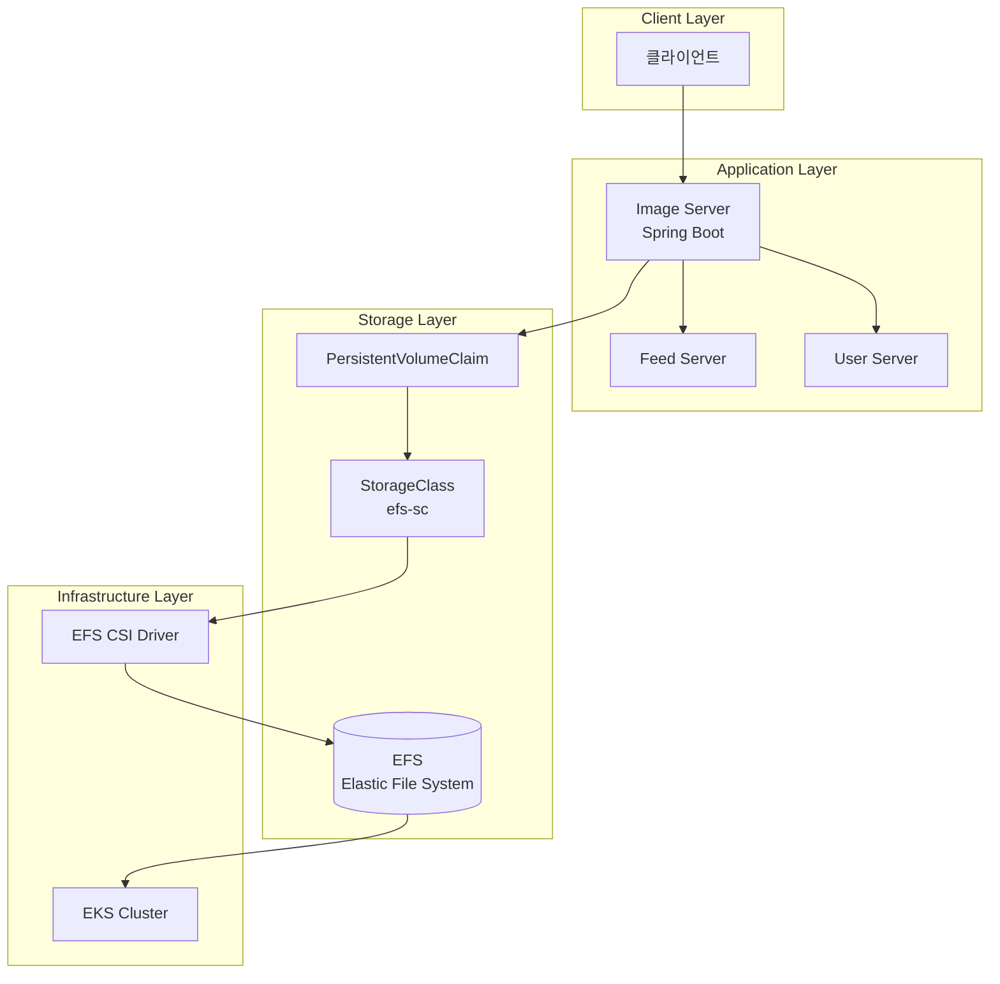
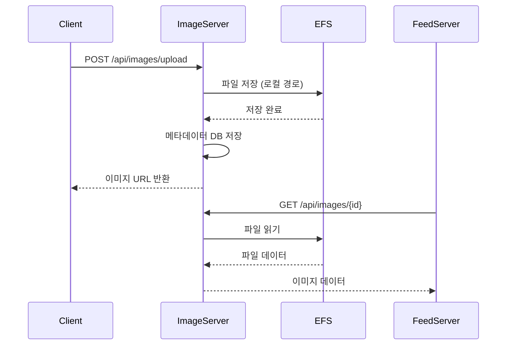
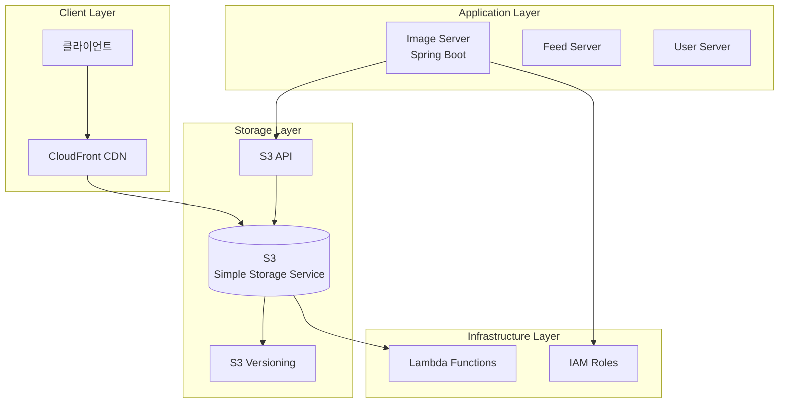
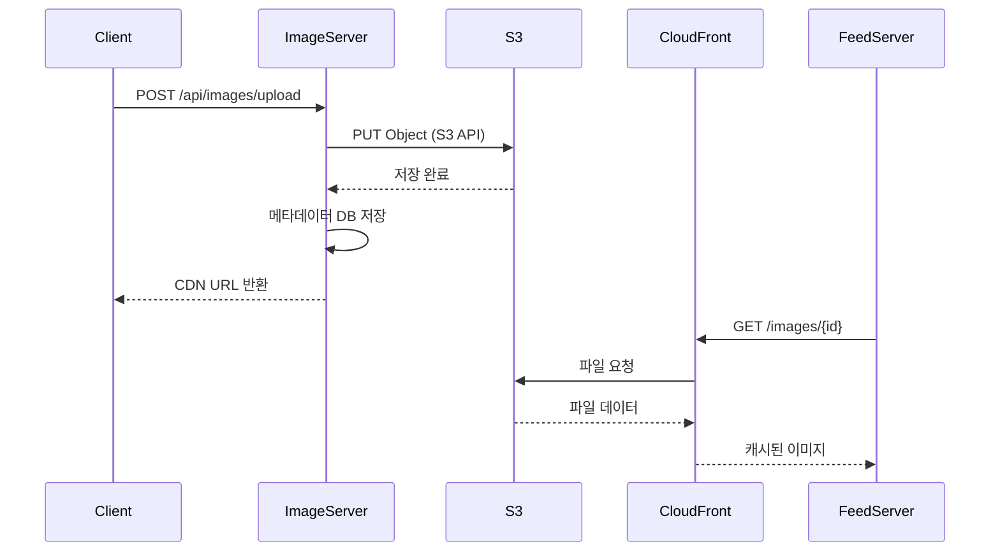
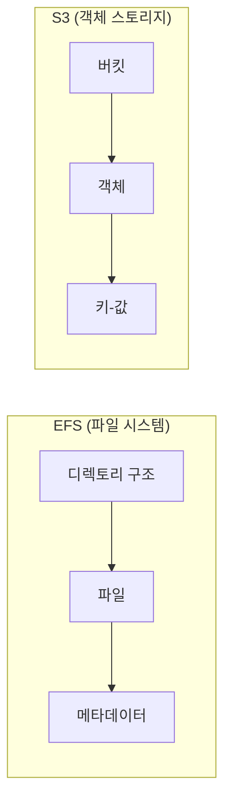

# Image Server 아키텍처 비교: EFS vs S3

이 문서는 현재 구현된 EFS 기반 Image Server와 S3 기반 Image Server의 아키텍처 차이점을 비교합니다.

## 📋 목차
1. [현재 EFS 기반 아키텍처](#1-현재-efs-기반-아키텍처)
2. [S3 기반 아키텍처](#2-s3-기반-아키텍처)
3. [아키텍처 비교](#3-아키텍처-비교)
4. [성능 비교](#4-성능-비교)
5. [비용 비교](#5-비용-비교)
6. [사용 사례별 권장사항](#6-사용-사례별-권장사항)
7. [마이그레이션 가이드](#7-마이그레이션-가이드)

---

## 1. 현재 EFS 기반 아키텍처

### 1.1 전체 아키텍처



### 1.2 주요 구성요소

#### **Image Server (Spring Boot)**
- **역할**: 이미지 업로드/다운로드 API 제공
- **기술**: Spring Boot, Java 21
- **저장 방식**: 로컬 파일 시스템 → EFS 마운트

#### **EFS (Elastic File System)**
- **역할**: 분산 파일 시스템
- **특징**: 
  - NFS 프로토콜 사용
  - 다중 AZ 지원
  - 자동 백업
  - 암호화 지원

#### **EFS CSI Driver**
- **역할**: Kubernetes와 EFS 연결
- **기능**: 
  - 동적 볼륨 프로비저닝
  - ReadWriteMany 지원
  - 자동 마운트/언마운트

### 1.3 데이터 플로우



### 1.4 장점
- ✅ **간단한 구현**: 파일 시스템 API 사용
- ✅ **실시간 접근**: 로컬 파일처럼 접근
- ✅ **비용 효율적**: 작은 규모에서 저렴
- ✅ **백업 자동화**: EFS 자동 백업
- ✅ **암호화**: 전송 중/저장 시 암호화

### 1.5 단점
- ❌ **확장성 제한**: 단일 파일 시스템
- ❌ **CDN 연동 복잡**: 별도 설정 필요
- ❌ **지역 분산 어려움**: 단일 리전
- ❌ **버전 관리 없음**: 파일 덮어쓰기
- ❌ **메타데이터 제한**: 파일 시스템 수준

---

## 2. S3 기반 아키텍처

### 2.1 전체 아키텍처



### 2.2 주요 구성요소

#### **Image Server (Spring Boot)**
- **역할**: 이미지 업로드/다운로드 API 제공
- **기술**: Spring Boot, AWS SDK
- **저장 방식**: S3 API를 통한 직접 저장

#### **S3 (Simple Storage Service)**
- **역할**: 객체 스토리지
- **특징**:
  - REST API 사용
  - 글로벌 분산
  - 버전 관리
  - 수명 주기 관리

#### **CloudFront CDN**
- **역할**: 글로벌 콘텐츠 전송
- **기능**:
  - 캐싱
  - 압축
  - HTTPS 지원
  - 지리적 분산

### 2.3 데이터 플로우



### 2.4 장점
- ✅ **무한 확장성**: 객체 기반 스토리지
- ✅ **글로벌 분산**: CloudFront CDN
- ✅ **버전 관리**: S3 버전 관리
- ✅ **수명 주기**: 자동 아카이빙/삭제
- ✅ **고가용성**: 99.99% SLA
- ✅ **비용 최적화**: 스토리지 클래스별 요금

### 2.5 단점
- ❌ **복잡한 구현**: S3 API 학습 필요
- ❌ **지연 시간**: API 호출 오버헤드
- ❌ **비용**: 대용량 시 높은 비용
- ❌ **의존성**: AWS 서비스에 강한 의존
- ❌ **설정 복잡**: IAM, CORS 등 설정 필요

---

## 3. 아키텍처 비교

### 3.1 상세 비교표

| 구분 | EFS 기반 | S3 기반 |
|------|----------|---------|
| **저장 방식** | 파일 시스템 | 객체 스토리지 |
| **접근 방식** | NFS 마운트 | REST API |
| **확장성** | 제한적 (단일 파일시스템) | 무제한 (객체 기반) |
| **지역 분산** | 단일 리전 | 글로벌 분산 |
| **CDN 연동** | 별도 설정 필요 | CloudFront 자동 연동 |
| **버전 관리** | 없음 | S3 버전 관리 |
| **백업** | EFS 자동 백업 | S3 수명 주기 |
| **암호화** | 전송/저장 시 암호화 | 전송/저장 시 암호화 |
| **비용** | 작은 규모에서 저렴 | 대용량에서 효율적 |
| **구현 복잡도** | 간단 | 복잡 |
| **성능** | 로컬 파일 수준 | 네트워크 지연 |

### 3.2 기술적 차이점

#### **파일 시스템 vs 객체 스토리지**


#### **접근 패턴**
- **EFS**: 파일 시스템 API (read/write)
- **S3**: HTTP REST API (GET/PUT/DELETE)

---

## 4. 성능 비교

### 4.1 처리량 비교

| 메트릭 | EFS | S3 |
|--------|-----|----|
| **읽기 성능** | 높음 (로컬 파일) | 중간 (네트워크) |
| **쓰기 성능** | 높음 (로컬 파일) | 중간 (네트워크) |
| **동시 접근** | 제한적 | 높음 |
| **지연 시간** | 낮음 | 중간 |
| **처리량** | 제한적 | 무제한 |

### 4.2 사용 시나리오별 성능

#### **소규모 사용 (1-1000 이미지/일)**
- **EFS**: ⭐⭐⭐⭐⭐ (최적)
- **S3**: ⭐⭐⭐⭐ (과도한 복잡성)

#### **중간 규모 (1000-10000 이미지/일)**
- **EFS**: ⭐⭐⭐⭐ (적절)
- **S3**: ⭐⭐⭐⭐⭐ (최적)

#### **대규모 (10000+ 이미지/일)**
- **EFS**: ⭐⭐ (부적절)
- **S3**: ⭐⭐⭐⭐⭐ (최적)

---

## 5. 비용 비교

### 5.1 비용 구조

#### **EFS 비용**
```
- 스토리지: $0.30/GB/월
- I/O: $0.0001/GB
- 백업: $0.05/GB/월
- 데이터 전송: $0.09/GB (리전 외)
```

#### **S3 비용**
```
- 스토리지: $0.023/GB/월 (Standard)
- 요청: $0.0004/1000 요청
- 데이터 전송: $0.09/GB (리전 외)
- CloudFront: $0.085/GB
```

### 5.2 규모별 비용 비교

| 규모 | EFS 월 비용 | S3 월 비용 | 차이 |
|------|-------------|------------|------|
| 100GB | $35 | $25 | S3 29% 저렴 |
| 1TB | $350 | $250 | S3 29% 저렴 |
| 10TB | $3,500 | $2,500 | S3 29% 저렴 |

---

## 6. 사용 사례별 권장사항

### 6.1 EFS 기반 권장 사례

#### ✅ **적합한 경우**
- **소규모 프로젝트**: 사용자 1000명 미만
- **빠른 개발**: 프로토타입 및 MVP
- **단순한 요구사항**: 기본 이미지 저장만 필요
- **비용 민감**: 초기 비용 최소화
- **실시간 처리**: 낮은 지연 시간 필요

#### 📝 **구현 예시**
```java
@Service
public class EFSImageService {
    @Value("${image.path:/images}")
    private String imagePath;
    
    public String saveImage(MultipartFile file) {
        String fileName = generateFileName(file);
        Path filePath = Paths.get(imagePath, fileName);
        Files.copy(file.getInputStream(), filePath);
        return fileName;
    }
}
```

### 6.2 S3 기반 권장 사례

#### ✅ **적합한 경우**
- **대규모 서비스**: 사용자 10000명 이상
- **글로벌 서비스**: 다국가 사용자
- **고가용성**: 99.9% 이상 가용성 필요
- **버전 관리**: 이미지 버전 관리 필요
- **CDN 활용**: 빠른 이미지 로딩 필요

#### 📝 **구현 예시**
```java
@Service
public class S3ImageService {
    @Autowired
    private AmazonS3 s3Client;
    
    public String saveImage(MultipartFile file) {
        String fileName = generateFileName(file);
        ObjectMetadata metadata = new ObjectMetadata();
        metadata.setContentType(file.getContentType());
        
        s3Client.putObject(bucketName, fileName, 
            file.getInputStream(), metadata);
        return s3Client.getUrl(bucketName, fileName).toString();
    }
}
```

---

## 7. 마이그레이션 가이드

### 7.1 EFS → S3 마이그레이션

#### **1단계: S3 인프라 설정**
```bash
# S3 버킷 생성
aws s3 mb s3://sns-images-bucket

# CloudFront 배포 생성
aws cloudfront create-distribution \
  --origin-domain-name sns-images-bucket.s3.amazonaws.com
```

#### **2단계: 코드 수정**
```java
// 기존 EFS 코드
@Service
public class EFSImageService {
    public String saveImage(MultipartFile file) {
        // 파일 시스템 저장
    }
}

// 새로운 S3 코드
@Service
public class S3ImageService {
    public String saveImage(MultipartFile file) {
        // S3 API 저장
    }
}
```

#### **3단계: 데이터 마이그레이션**
```bash
# EFS에서 S3로 데이터 복사
aws s3 sync /efs/images s3://sns-images-bucket/
```

#### **4단계: 점진적 전환**
```java
@Service
public class HybridImageService {
    @Value("${storage.type:efs}")
    private String storageType;
    
    public String saveImage(MultipartFile file) {
        if ("s3".equals(storageType)) {
            return s3Service.saveImage(file);
        } else {
            return efsService.saveImage(file);
        }
    }
}
```

### 7.2 마이그레이션 체크리스트

- [ ] S3 버킷 및 IAM 권한 설정
- [ ] CloudFront 배포 구성
- [ ] 코드 수정 및 테스트
- [ ] 데이터 마이그레이션
- [ ] DNS 설정 변경
- [ ] 모니터링 설정
- [ ] 롤백 계획 수립

---

## 📊 **결론**

### **현재 EFS 기반 선택이 적절한 경우:**
- ✅ 프로토타입 및 MVP 개발
- ✅ 소규모 사용자 (1000명 미만)
- ✅ 빠른 개발 및 배포 필요
- ✅ 비용 최적화 우선

### **S3 기반으로 전환을 고려해야 하는 경우:**
- ✅ 대규모 사용자 증가 예상
- ✅ 글로벌 서비스 계획
- ✅ 고가용성 요구사항
- ✅ CDN 활용 필요

### **권장사항:**
현재 SNS 프로젝트의 규모와 단계를 고려할 때, **EFS 기반 아키텍처가 적절**합니다. 향후 사용자 증가나 글로벌 확장이 필요할 때 S3로 마이그레이션하는 것을 권장합니다. 