# SNS Project Infrastructure Setup

## 🚀 프로ì íŠ¸ 개요

ì´ í”„ë¡œì íŠ¸ëŠ” EKS ì율 모드(Autonomous Mode)를 기반으로 í•œ SNS 애플리케ì´ì…˜ì˜ ì¸í”„ë¼ ì„¤ì •ì„ í¬í•¨í•©ë‹ˆë‹¤.

### 📋 주요 구성 요소
- **EKS ì율 모드 í´ëŸ¬ìŠ¤í„°**: ìë™ ë…¸ë“œ 관리 ë° ìŠ¤ì¼€ì¼ë§
- **EFS 스토리지**: 공유 íŒŒì¼ ì‹œìŠ¤í…œ
- **Fargate 프로파ì¼**: 서버리스 컴퓨팅 옵션
- **하ì´ë¸Œë¦¬ë“œ 구성**: ìë™ ë…¸ë“œ í’€ + Fargate ì¡°í•©
- **모니터ë§**: Prometheus, Grafana, KubeCost

## âš ï¸ ë¹„ìš© 주ì˜ì‚¬í•­

- AWS EKS, EC2, RDS 사용 ì‹œ 시간당 ë¹„ìš©ì´ ë°œìƒí•©ë‹ˆë‹¤
- 실습 완료 후 반드시 ì¸í”„ë¼ë¥¼ 정리해주세요
- 비용 최ì í™”를 위해 ìë™ ìŠ¤ì¼€ì¼ë§ ì„¤ì •ì„ ê¶Œì¥í•©ë‹ˆë‹¤

## ğŸ—ï¸ ì¸í”„ë¼ ì•„í‚¤í…처

### EKS ì율 모드 구성
```
┌─────────────────────────────────────────────────────────────â”
│                    EKS ì율 모드 í´ëŸ¬ìŠ¤í„°                    │
├─────────────────────────────────────────────────────────────┤
│  ìë™ ë…¸ë“œ í’€ (Autonomous Node Pools)                        │
│  ├── system 노드 풀: kube-system, monitoring 등              │
│  └── general-purpose 노드 í’€: 애플리케ì´ì…˜ 워í¬ë¡œë“œ           │
├─────────────────────────────────────────────────────────────┤
│  Fargate í”„ë¡œíŒŒì¼ (ì„ íƒì‚¬í•­)                                  │
│  └── 서버리스 컴퓨팅 옵션                                     │
├─────────────────────────────────────────────────────────────┤
│  EFS 스토리지                                                 │
│  └── 공유 íŒŒì¼ ì‹œìŠ¤í…œ (ì´ë¯¸ì§€ 업로드 등)                      │
└─────────────────────────────────────────────────────────────┘
```

## ğŸ› ï¸ ë¹ ë¥¸ ì‹œì‘ ê°€ì´ë“œ

### 1. 사전 요구사항
- AWS CLI 설치 ë° ì„¤ì •
- kubectl 설치
- eksctl 설치 (ì„ íƒì‚¬í•­)

### 2. í´ëŸ¬ìŠ¤í„° ìƒì„±
```bash
# AWS 콘솔ì—ì„œ EKS ì율 모드로 í´ëŸ¬ìŠ¤í„° ìƒì„±
# í´ëŸ¬ìŠ¤í„° ì´ë¦„: sns-cluster
# 지역: ap-northeast-2 (서울)
```

### 3. 스í¬ë¦½íŠ¸ë¥¼ 통한 ìë™ ì„¤ì •
```bash
cd infra/script

# ë„¤íŠ¸ì›Œí¬ ì •ë³´ 확ì¸
./utils/get_network_info.sh

# EFS 설정 (ê°œì„ ëœ ìŠ¤í¬ë¦½íŠ¸)
./storage/setup-efs.sh

# 설정 확ì¸
kubectl get storageclass
kubectl get pvc -n sns

# Fargate í”„ë¡œíŒŒì¼ ì„¤ì • (ì„ íƒì‚¬í•­)
./compute/setup_fargate.sh

# 통합 관리
./core/manage_storage.sh setup-efs
./core/manage_storage.sh check-status
```

## 📠스í¬ë¦½íŠ¸ 구조

```
infra/script/
├── core/                    # 핵심 관리 스í¬ë¦½íŠ¸
│   ├── manage_storage.sh    # 통합 스토리지 관리
│   ├── create.sh           # 리소스 ìƒì„±
│   ├── diagnose.sh         # 진단 ë„구
│   ├── fix.sh              # 문제 해결
│   └── monitor.sh          # 모니터ë§
├── storage/                # 스토리지 관련
│   ├── setup-efs.sh        # EFS 설정 (개선ë¨)
│   └── cleanup-efs.sh      # EFS 정리
├── compute/                # 컴퓨팅 관련
│   └── setup_fargate.sh    # Fargate 설정
├── utils/                  # 유틸리티 스í¬ë¦½íŠ¸
│   ├── get_network_info.sh # ë„¤íŠ¸ì›Œí¬ ì •ë³´
│   ├── check_efs_status.sh # EFS ìƒíƒœ 확ì¸
│   ├── check_fargate_status.sh # Fargate ìƒíƒœ 확ì¸
│   └── ...                 # 기타 유틸리티
└── configs/                # 설정 파ì¼
    ├── efs-setup.yaml      # EFS Kubernetes 설정
    ├── efs-csi-policy.json # EFS CSI Driver IAM 정책
    └── aws-auth.yaml       # AWS ì¸ì¦ 설정
```

## 🆕 2025 Update: EKS ì율 모드 (Autonomous Mode)

EKSê°€ 2024ë…„ 12ì›” ì율 모드 ì—…ë°ì´íŠ¸ì™€ 함께 관리형 ì½˜ì†”ì˜ UIê°€ í¬ê²Œ 변경ë˜ì—ˆìŠµë‹ˆë‹¤. ì´ ë¬¸ì„œëŠ” ì율 모드를 기준으로 ì‘성ë˜ì—ˆìœ¼ë©°, 기존 ê°•ì˜ì˜ 코딩 관련 ë¶€ë¶„ì€ ë³€ê²½ë˜ì§€ 않았습니다.

### 🔄 주요 변경사항
- **ìë™ ë…¸ë“œ 관리**: ìˆ˜ë™ ë…¸ë“œ 그룹 대신 ìë™ ë…¸ë“œ í’€ 사용
- **ìë™ ìŠ¤ì¼€ì¼ë§**: 워í¬ë¡œë“œì— 따른 ìë™ ë¦¬ì†ŒìŠ¤ ì¡°ì •
- **ìë™ ì—…ë°ì´íŠ¸**: 보안 패치 ë° ë²„ì „ ì—…ë°ì´íŠ¸ ìë™í™”
- **하ì´ë¸Œë¦¬ë“œ 구성**: ìë™ ë…¸ë“œ í’€ + Fargate ì¡°í•© 지ì›

### 📚 참고 ì료
- [AWS EKS 사용ì ê°€ì´ë“œ](https://docs.aws.amazon.com/ko_kr/eks/latest/userguide/what-is-eks.html)
- [EKS ì율 모드 ê°€ì´ë“œ](https://docs.aws.amazon.com/ko_kr/eks/latest/userguide/eks-autonomous-mode.html)

## ğŸ—ï¸ í´ëŸ¬ìŠ¤í„° ìƒì„± ê°€ì´ë“œ

### 1. AWS 콘솔 ì ‘ì†

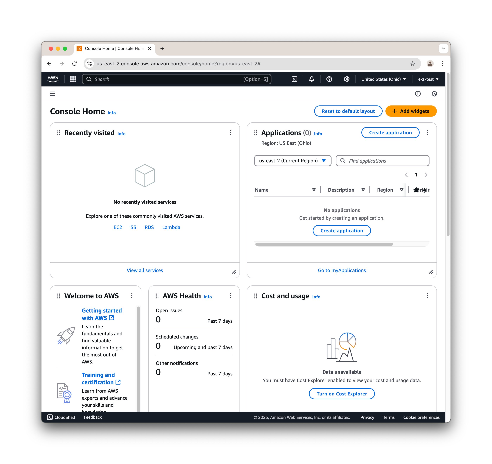

AWS ì½˜ì†”ì— ë¡œê·¸ì¸í•©ë‹ˆë‹¤. 루트 계정 ë˜ëŠ” 충분한 ê¶Œí•œì„ ê°€ì§„ 서브 ê³„ì •ì„ ì‚¬ìš©í•  수 ìˆìŠµë‹ˆë‹¤. 기존 í™˜ê²½ê³¼ì˜ ë¦¬ì†ŒìŠ¤ 충ëŒì„ 방지하기 위해 서브 계정 ì‚¬ìš©ì„ ê¶Œì¥í•©ë‹ˆë‹¤.


### 2. 리전 설정


ì²˜ìŒ ë¡œê·¸ì¸í•œ ê³„ì •ì€ ê¸°ë³¸ì ìœ¼ë¡œ us-east-1 ë˜ëŠ” us-east-2 리전으로 설정ë˜ì–´ ìˆìŠµë‹ˆë‹¤. ë„¤íŠ¸ì›Œí¬ ì§€ì—°ì„ ì¤„ì´ê¸° 위해 거주 지역과 가까운 ë¦¬ì „ì„ ì„ íƒí•˜ëŠ” ê²ƒì„ ê¶Œì¥í•©ë‹ˆë‹¤.

**ê¶Œì¥ ë¦¬ì „**: ëŒ€í•œë¯¼êµ­ì˜ ê²½ìš° `ap-northeast-2` (서울)

> âš ï¸ **주ì˜**: IAM, CDN 등 리전과 무관한 서비스 사용 ì‹œ ë¦¬ì „ì´ ë³€ê²½ë˜ì–´ 기존 리소스가 ë³´ì´ì§€ ì•Šì„ ìˆ˜ ìˆìŠµë‹ˆë‹¤. ì‘ì—… ì „ í˜„ì¬ ë¦¬ì „ì„ í™•ì¸í•´ì£¼ì„¸ìš”.
> 

### 3. EKS 서비스 ì ‘ì†

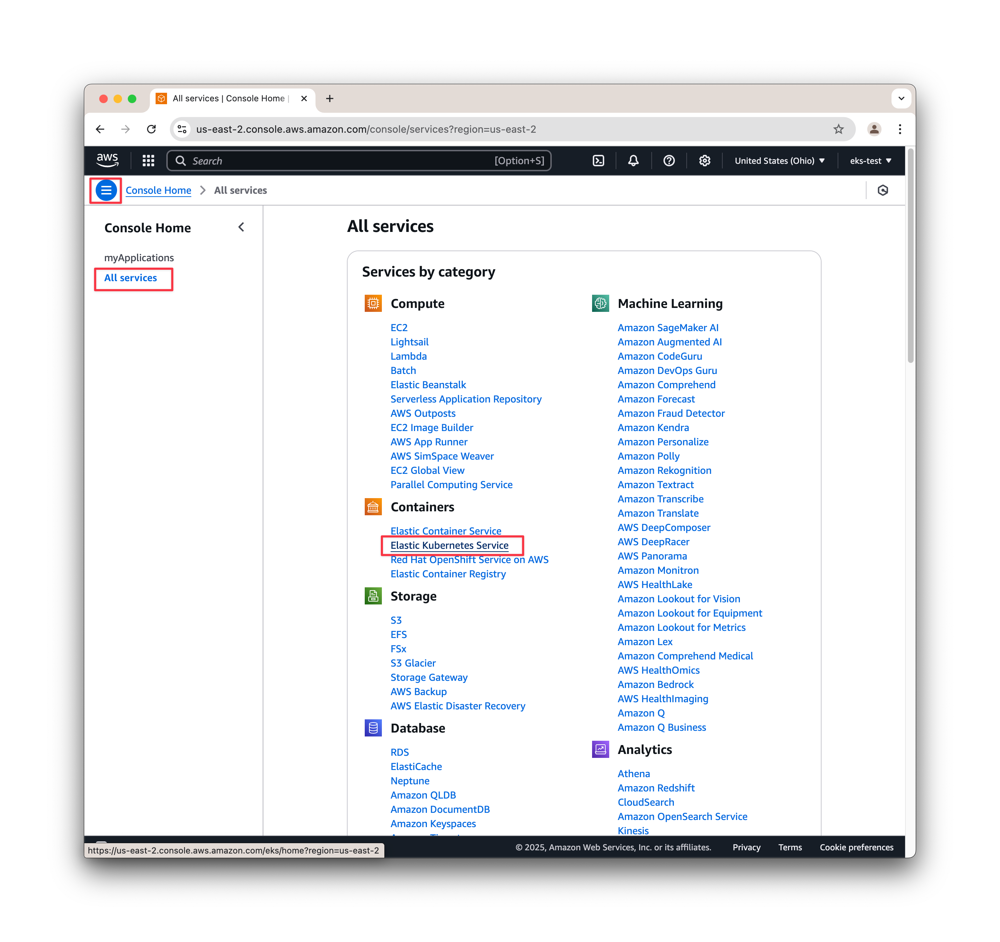

EKSì—ì„œ í´ëŸ¬ìŠ¤í„°ë¥¼ ìƒì„±í•˜ê¸° 위해 메뉴ì—ì„œ **Elastic Kubernetes Service**를 찾아 ì„ íƒí•©ë‹ˆë‹¤. 메뉴 구조가 ì주 변경ë˜ë¯€ë¡œ, ìƒë‹¨ 검색창ì—ì„œ "EKS" ë˜ëŠ” "Kubernetes"ë¡œ 검색하여 ì„ íƒí•˜ëŠ” ê²ƒì„ ê¶Œì¥í•©ë‹ˆë‹¤.

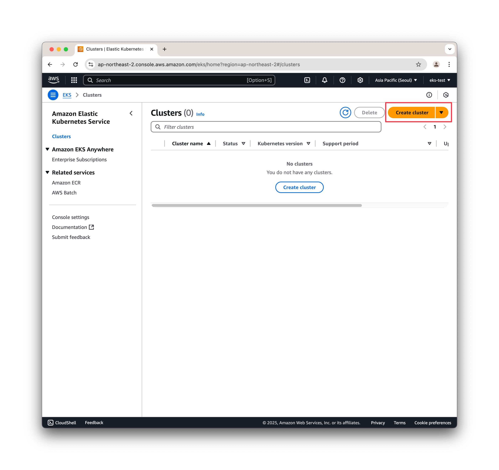

ì²˜ìŒ ì ‘ì† ì‹œ í´ëŸ¬ìŠ¤í„°ê°€ 없는 ê²ƒì„ í™•ì¸í•  수 ìˆìŠµë‹ˆë‹¤. **Create cluster** ë²„íŠ¼ì„ í´ë¦­í•˜ì—¬ í´ëŸ¬ìŠ¤í„° ìƒì„±ì„ ì‹œì‘합니다.


### 4. í´ëŸ¬ìŠ¤í„° ìƒì„± ë°©ì‹ ì„ íƒ


í´ëŸ¬ìŠ¤í„° ìƒì„± ë°©ì‹ì€ ë‘ ê°€ì§€ ì˜µì…˜ì´ ìˆìŠµë‹ˆë‹¤:

1. **EKS ì율 모드 (권ì¥)**: ìë™ìœ¼ë¡œ í´ëŸ¬ìŠ¤í„°ë¥¼ ìƒì„±í•˜ê³  관리
2. **Custom configuration**: 세부 ì„¤ì •ì„ ì§ì ‘ 조정하여 ìƒì„±

> 💡 **참고**: Custom configurationì„ ì„ íƒí•´ë„ 기본ì ìœ¼ë¡œ EKS ì율 모드가 ì ìš©ë©ë‹ˆë‹¤. ì율 모드를 사용하지 않으려면 설정ì—ì„œ "Use EKS Auto Mode"를 비활성화해야 합니다.

**EKS ì율 ëª¨ë“œì˜ íŠ¹ì§•**:
- í´ëŸ¬ìŠ¤í„° ìƒì„± 후 노드, 스토리지, ë„¤íŠ¸ì›Œí¬ ìì›ì„ ìë™ ê´€ë¦¬
- ìë™ ìŠ¤ì¼€ì¼ë§ ë° ì—…ë°ì´íŠ¸
- 하ì´ë¸Œë¦¬ë“œ 구성 ì§€ì› (ìë™ ë…¸ë“œ í’€ + Fargate)


### 5. í´ëŸ¬ìŠ¤í„° 기본 설정


**í´ëŸ¬ìŠ¤í„° 설정**:
- **í´ëŸ¬ìŠ¤í„° ì´ë¦„**: `sns-cluster` (ê¸°ë³¸ê°’ì„ ë³€ê²½)
- **Cluster IAM role**: "Create recommended role" 버튼 í´ë¦­
- **Node IAM role**: "Create recommended role" 버튼 í´ë¦­

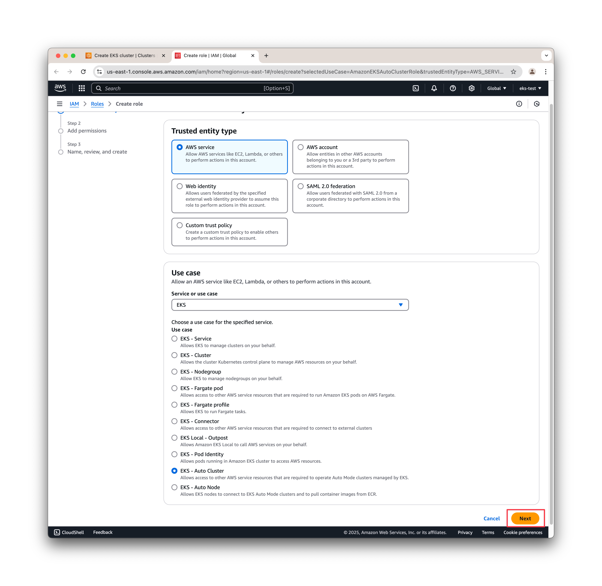

**IAM ì—­í•  ìƒì„±**:
기본ì ìœ¼ë¡œ 필요한 ê¶Œí•œì´ ëª¨ë‘ ìë™ ì„ íƒë˜ì–´ ìˆìŠµë‹ˆë‹¤. ë³„ë„ ë³€ê²½ ì—†ì´ **Next** ë²„íŠ¼ì„ í´ë¦­í•©ë‹ˆë‹¤.


ì´í›„ ê³„ì† Next ë²„íŠ¼ì„ ëˆ„ë¥¸ ë’¤ Create role ë²„íŠ¼ì„ ëˆ„ë¥´ë©´ AmazonEKSAutoClusterRoleì´ ìƒì„±ë˜ëŠ” ê²ƒì„ í™•ì¸í•  수 ìˆìŠµë‹ˆë‹¤.

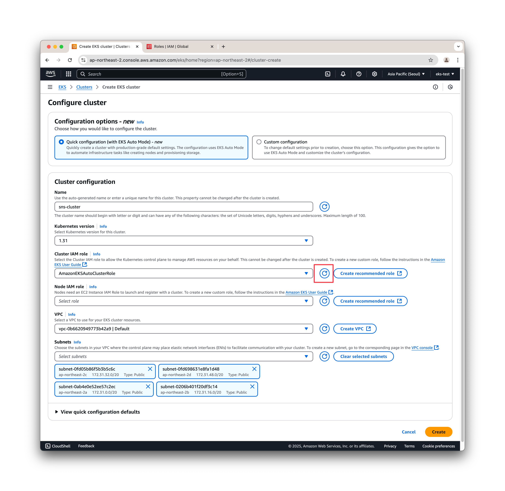

ì´í›„ í´ëŸ¬ìŠ¤í„° ìƒì„± 탭으로 ëŒì•„온 ë’¤ 리프ë˜ì‹œ ë²„íŠ¼ì„ ëˆŒëŸ¬ì„œ 방금 ìƒì„±ëœ AmazonEKSAutoClusterRoleì„ Cluster IAM roleì— ì§€ì •í•´ì¤ë‹ˆë‹¤. ì´í›„ Node IAM role ì—­ì‹œ Create recommended role ë²„íŠ¼ì„ ëˆŒëŸ¬ì„œ ë””í´íŠ¸ roleì„ ìƒì„±í•´ì¤ë‹ˆë‹¤.

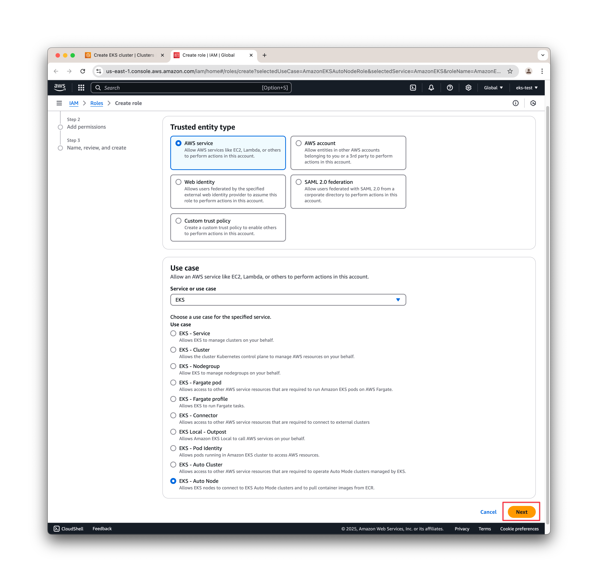

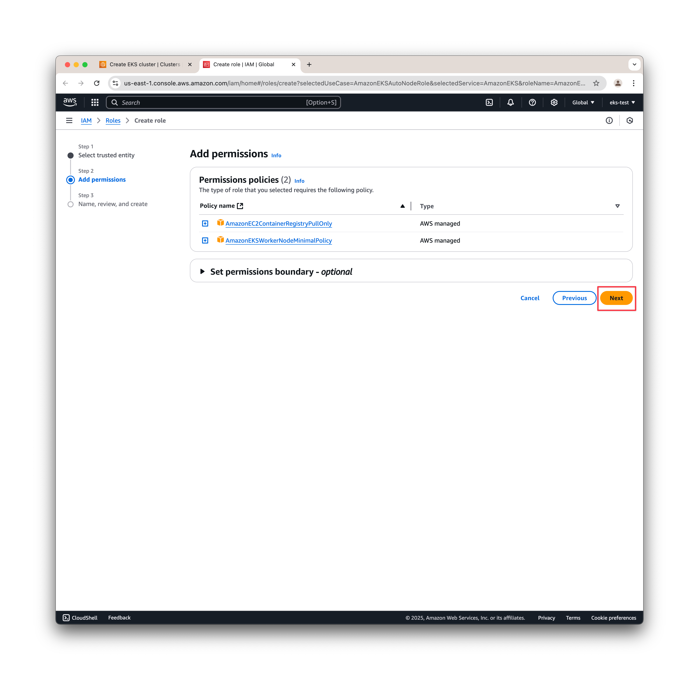

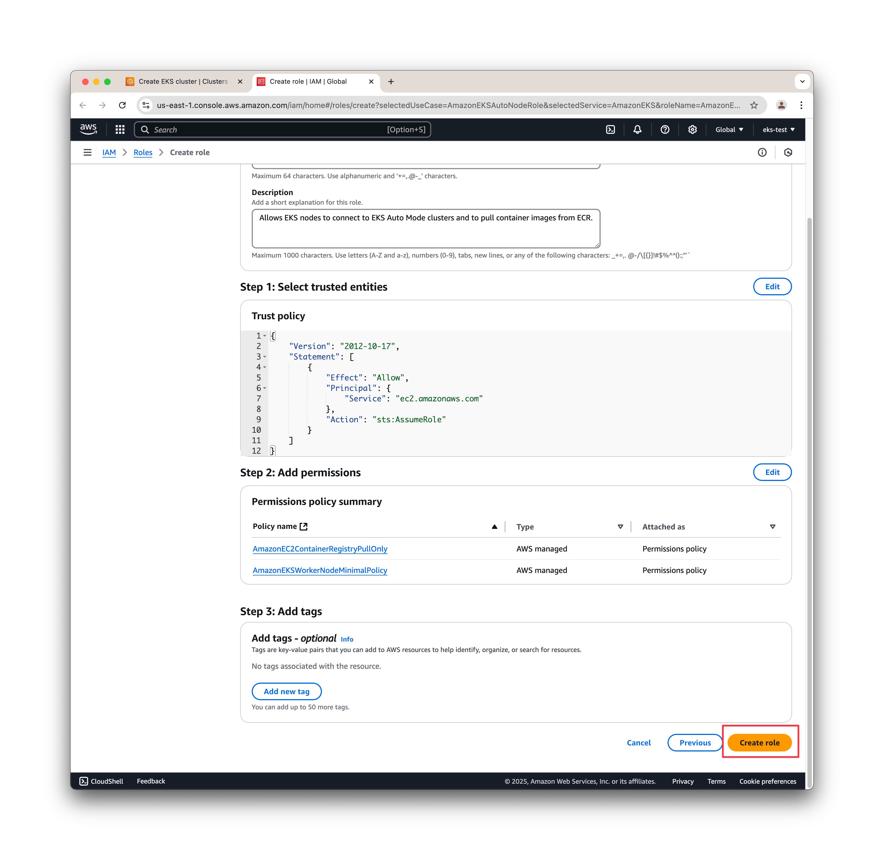


Node IAM role ì—­ì‹œ í´ëŸ¬ìŠ¤í„° ìƒì„± 탭ì—ì„œ 리프ë˜ì‹œ ë²„íŠ¼ì„ ëˆŒëŸ¬ì„œ ìƒì„±ëœ roleì„ ì§€ì •í•´ì¤ë‹ˆë‹¤.


ì´í›„ Create ë²„íŠ¼ì„ ëˆŒëŸ¬ì„œ í´ëŸ¬ìŠ¤í„°ë¥¼ ìƒì„±í•©ë‹ˆë‹¤. 여기ì—ì„œ VPC와 Subnetì€ ë””í´íŠ¸ VPC와 ë””í´íŠ¸ Subnetì„ ì‚¬ìš©í–ˆìŠµë‹ˆë‹¤. 다만 실제로 AWSì—ì„œ 리소스를 ìƒì„±í•  ë•Œ ë””í´íŠ¸ VPC를 사용하는 ê²ƒì€ í¬ê²Œ 권ì¥ë˜ëŠ” ì„¤ì •ì€ ì•„ë‹™ë‹ˆë‹¤. 만약 VPC와 ì„œë¸Œë„·ì— ê´€ë ¨í•œ ë„¤íŠ¸ì›Œí¬ ì§€ì‹ì´ ìˆìœ¼ì‹  ë¶„ì€ Create VPC ë²„íŠ¼ì„ ëˆŒëŸ¬ì„œ, í˜¹ì€ VPC 메뉴ì—ì„œ ì§ì ‘ VPC와 ì„œë¸Œë„·ì„ ìƒì„±í•´ì„œ ì‚¬ìš©í•˜ì…”ë„ ì¢‹ìŠµë‹ˆë‹¤. 여기ì—ì„œ ì„œë¸Œë„·ì€ ëª¨ë‘ í¼ë¸”릭 ì„œë¸Œë„·ì„ ì‚¬ìš©í•´ì„œ 구성하고 ìˆìœ¼ë‚˜, 실제로는 ìš©ë„ì— ë”°ë¼ í”„ë¼ì´ë¹— ì„œë¸Œë„·ë“±ì„ êµ¬ë¶„í•˜ì—¬ 사용해줄 ìˆ˜ë„ ìˆìŠµë‹ˆë‹¤. 여기ì—서는 간단한 ì‹¤ìŠµì„ ìœ„í•´ ë””í´íŠ¸ VPC와 ì„œë¸Œë„·ì„ ì‚¬ìš©í•˜ê² ìŠµë‹ˆë‹¤. ë”°ë¼ì„œ 기본 ì„¤ì •ì„ ë³€ê²½í•˜ì§€ ì•Šê³  Create를 눌러ì¤ë‹ˆë‹¤.

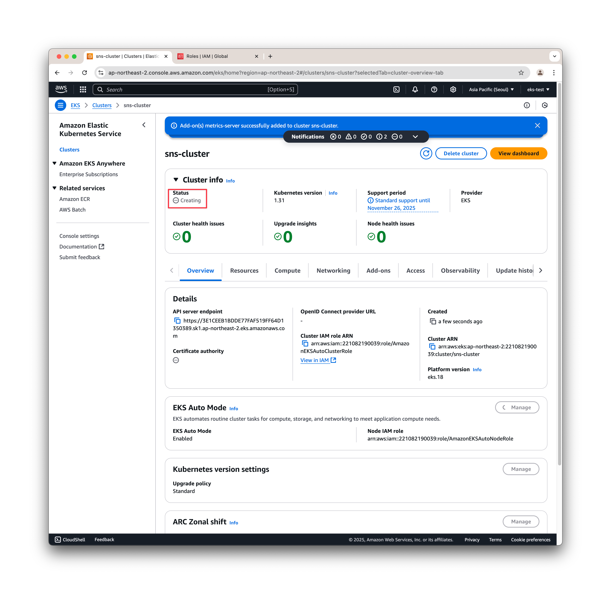

í´ëŸ¬ìŠ¤í„° ìƒì„±ì—는 몇 분ì—ì„œ 몇 ì‹­ 분 ì •ë„ì˜ ì‹œê°„ì´ í•„ìš”í•©ë‹ˆë‹¤. ìƒíƒœê°€ Creatingë¡œ 표시ë˜ëŠ” ê²ƒì„ í™•ì¸í•˜ê³  í´ëŸ¬ìŠ¤í„° ìƒì„±ì´ 완료ë ë•Œê¹Œì§€ 기다립니다.


í´ëŸ¬ìŠ¤í„° ìƒì„±ì´ 완료ë˜ë©´ ìƒíƒœê°€ Activeë¡œ ë°”ë€ë‹ˆë‹¤. 만약 별ë„ì˜ ë…¸ë“œ ìƒì„± ì—†ì´ Auto Mode로만 í´ëŸ¬ìŠ¤í„°ë¥¼ 활용하고ì 한다면 ì´ ìƒíƒœì—ì„œ ì‹¤ìŠµì„ ì§„í–‰í•´ë„ ë©ë‹ˆë‹¤. 다만 ì´ ë•ŒëŠ” ìƒì„±ë˜ëŠ” Deploymentì˜ Pod Templateì— ë‹¤ìŒê³¼ ê°™ì´ Node Selector를 지정해주어야 합니다. 

```yaml
apiVersion: apps/v1
kind: Deployment
spec:
  replicas: 1
  template:
    spec:
      nodeSelector:
        eks.amazonaws.com/compute-type: auto
...
```

해당 ì„¤ì •ì€ ê°•ì˜ì—서는 커버ë˜ì§€ 않는 ë‚´ìš©ì´ê¸° ë•Œë¬¸ì— ì—¬ê¸°ì—서는 ê°•ì˜ì™€ í™˜ê²½ì„ ì¼ì¹˜ì‹œí‚¤ê¸° 위해 관리형 노드 ê·¸ë£¹ì„ ìƒì„±í•´ì£¼ë„ë¡ í•˜ê² ìŠµë‹ˆë‹¤. 노드 ê·¸ë£¹ì„ ìƒì„±í•˜ê¸° ì „ì— ë¨¼ì € 플러그ì¸ì„ 설치하기 위해 í´ëŸ¬ìŠ¤í„°ì˜ 탭ì—ì„œ Add-ons를 ì„ íƒí•©ë‹ˆë‹¤.


Get more add-ons ë²„íŠ¼ì„ ëˆŒëŸ¬ì„œ 애드온 추가 í™”ë©´ì— ë“¤ì–´ê°‘ë‹ˆë‹¤.

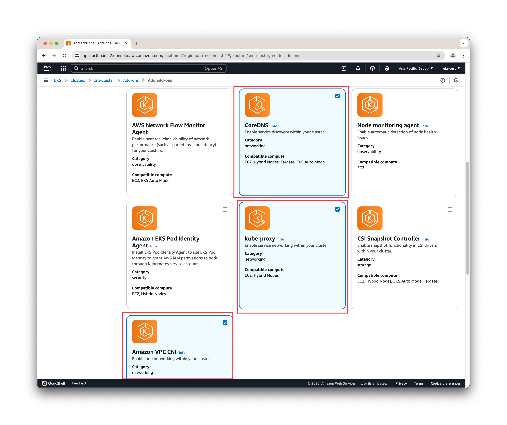

여기ì—서는 CoreDNS, kube-proxy, Amazon VPC CNI를 ì„ íƒí•˜ì—¬ 설치해ì¤ë‹ˆë‹¤.


ë²„ì „ë“±ì˜ ì„¤ì •ì€ ìë™ìœ¼ë¡œ 설정ë˜ê¸° ë•Œë¬¸ì— Next를 눌러ì¤ë‹ˆë‹¤.


ì´í›„ ì„ íƒí•œ ì• ë“œì˜¨ì´ ì„¤ì¹˜ë˜ëŠ” ê²ƒì„ í™•ì¸í•  수 ìˆìŠµë‹ˆë‹¤. ì¼ë°˜ì ìœ¼ë¡œ ì˜¤ë˜ ê±¸ë¦¬ì§€ëŠ” 않습니다.

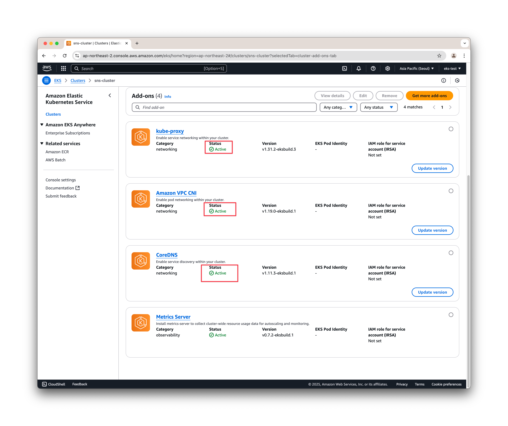

ì´í›„ 모든 ì• ë“œì˜¨ì˜ ìƒíƒœê°€ Activeë¡œ 변하면 설치가 ì™„ë£Œëœ ê²ƒì…니다.


ì´í›„ 노드를 ìƒì„±í•˜ê¸° 위해 í´ëŸ¬ìŠ¤í„° í™”ë©´ì˜ Compute íƒ­ì„ ëˆ„ë¥´ê³  Add node groupì„ ì„ íƒí•©ë‹ˆë‹¤.


여기ì—ì„œ 노드 ê·¸ë£¹ì˜ ì´ë¦„ì„ sns-nodeë¡œ 설정합니다. 그리고 Node IAM roleì€ ê¸°ë³¸ì ìœ¼ë¡œ AmazonEKSAutoNodeRoleë¡œ 설정ë˜ì–´ ìˆëŠ”ë° ì´ roleì„ ê·¸ëŒ€ë¡œ 사용하면 노드 ìƒì„±ì´ ì •ìƒì ìœ¼ë¡œ ì´ë£¨ì–´ì§€ì§€ 않습니다. 여기ì—서는 Create recommended role ë²„íŠ¼ì„ ëˆŒëŸ¬ì„œ 새로운 관리형 노드용 roleì„ ë§Œë“¤ì–´ì£¼ê² ìŠµë‹ˆë‹¤.

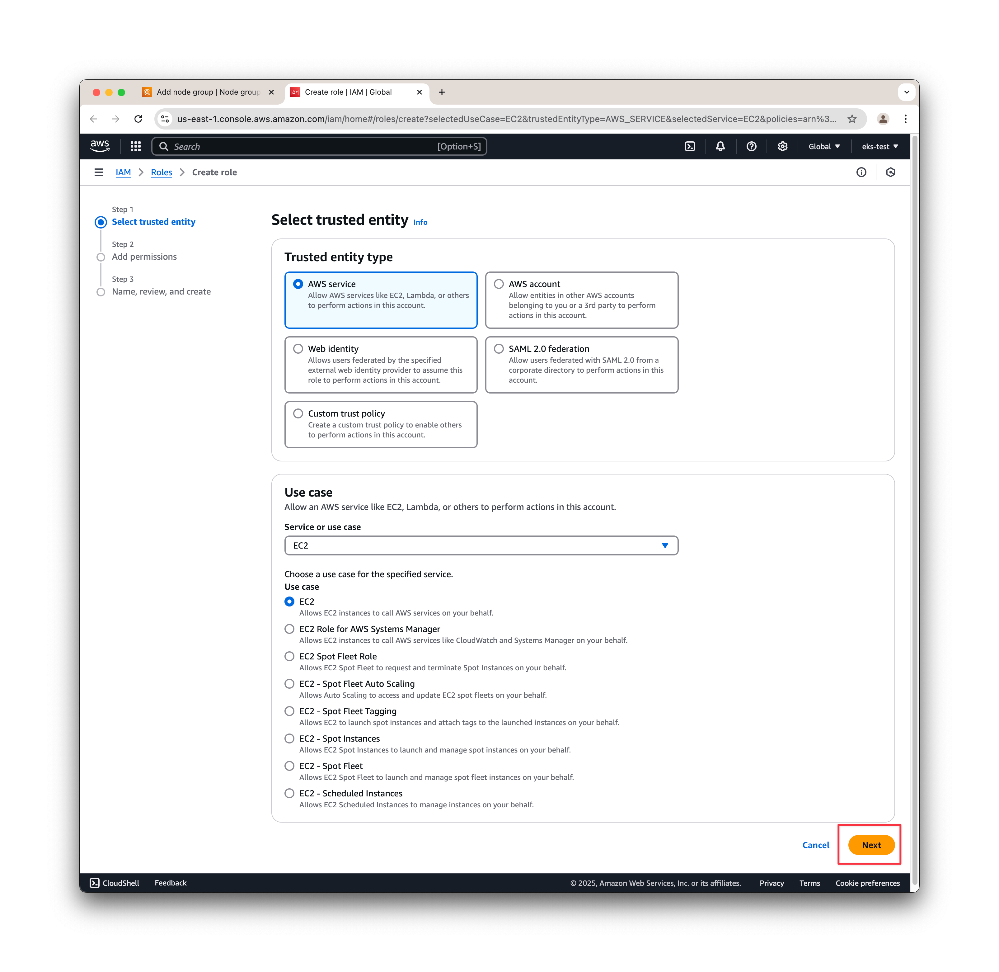

여기ì—서는 기본ì ìœ¼ë¡œ EC2ê°€ Use caseë¡œ ì„ íƒë˜ì–´ ìˆìŠµë‹ˆë‹¤. 변경 ì—†ì´ Next를 누릅니다.


여기ì—ì„œ 별다른 ê¶Œí•œì´ ì¶”ê°€ë˜ì§€ ì•Šì€ ê²ƒì²˜ëŸ¼ ë³´ì¼ ìˆ˜ ìˆëŠ”ë° ì‹¤ì œë¡œëŠ” EKS ë…¸ë“œì— í•„ìš”í•œ ê¶Œí•œì´ ìë™ìœ¼ë¡œ ì„ íƒë˜ì–´ìˆëŠ” ìƒíƒœì…니다. 실제로 ìœ„ì— ë³´ë©´ 3/1025ë¼ëŠ” 형태로 3ê°œì˜ ê¶Œí•œì´ ì„ íƒë˜ì–´ ìˆìŒì„ ì•Œ 수 ìˆìŠµë‹ˆë‹¤. 여기ì—ì„œ 변경 ì—†ì´ Next를 누릅니다.


role ì´ë¦„ì€ sns-node-roleë¡œ 지정해ì¤ë‹ˆë‹¤. EKS ë…¸ë“œì— í•„ìš”í•œ ê¶Œí•œì´ ì•„ë˜ ì¶”ê°€ë˜ì–´ ìˆìŒì„ 확ì¸í•˜ê³  create roleì„ ëˆŒëŸ¬ì„œ roleì„ ìƒì„±í•˜ì¤ë‹ˆë‹¤.


ì´í›„ 노드 ìƒì„± 탭으로 다시 ëŒì•„와서 리프ë˜ì‹œ ë²„íŠ¼ì„ ëˆŒëŸ¬ì„œ 방금 ìƒì„±í•œ sns-node-roleì„ ì§€ì •í•´ì¤ë‹ˆë‹¤.

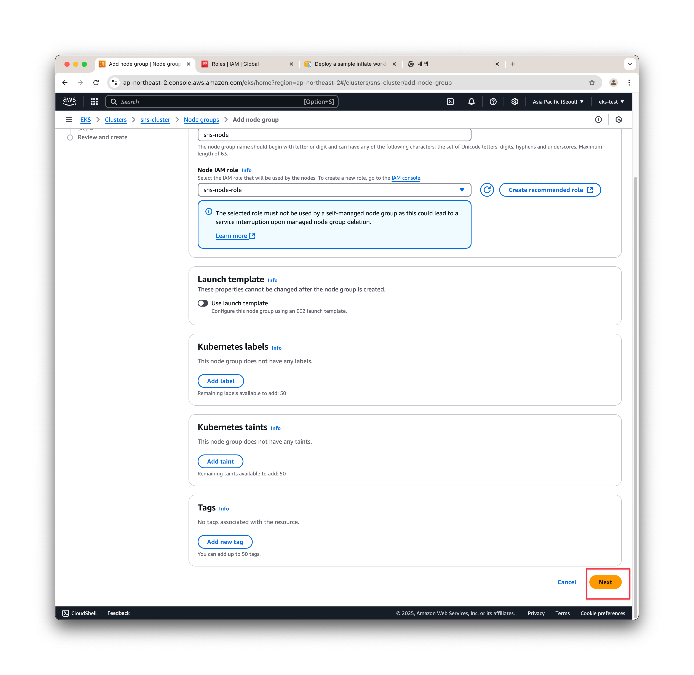

그리고 다른 ì„¤ì •ì€ ë³€ê²½ ì—†ì´ Next ë²„íŠ¼ì„ ëˆ„ë¦…ë‹ˆë‹¤.


노드 스í™ì„ 결정합니다. 여기ì—ì„œ 다른 스í™ì€ 변경 ì—†ì´ ì‚¬ìš©í•˜ê³  노드 ê·¸ë£¹ì˜ ìˆ˜ëŸ‰ë§Œ 지정, 최소, 최대 ìˆ˜ëŸ‰ì„ 2ê°œì—ì„œ 3개로 변경해ì¤ë‹ˆë‹¤. 실제로 ì‹¤ìŠµì€ 2ê°œì˜ ë…¸ë“œë¡œë„ ì§„í–‰í•  수 ìˆìœ¼ë‚˜ ì¼ë¶€ 예외ì ì¸ ìƒí™©ì„ 위해 3개로 지정하는 ê²ƒì´ ë” í¸í•˜ê²Œ 사용할 수 ìˆìŠµë‹ˆë‹¤. 다만 ë…¸ë“œì˜ ìˆ˜ëŸ‰ì´ ëŠ˜ì–´ë‚˜ë©´ í´ëŸ¬ìŠ¤í„° 사용 ë¹„ìš©ë„ ì¦ê°€í•˜ë¯€ë¡œ 2개로 지정해서 사용하다가 부족할 경우 (Podê°€ ê³„ì† Pending ìƒíƒœì— 머무를 경우) 3개로 ì¦ê°€ì‹œì¼œì¤˜ë„ 좋습니다. ê°•ì˜ì—ì„œ ì„¤ëª…í–ˆë˜ í™˜ê²½ì— ë¹„í•´ì„œ EKS Auto Mode를 사용할 경우 컨트롤러 íŒŒë“œë“¤ì´ ë³„ë„ì˜ ìë™ ìƒì„±ëœ 노드ì—ì„œ 관리ë˜ë¯€ë¡œ ìì› ì‚¬ìš©ì—는 조금 ë” ì—¬ìœ ê°€ ìˆëŠ” í¸ì…니다.


ë„¤íŠ¸ì›Œí¬ ì„¤ì •ì—서는 기본ì ìœ¼ë¡œ ì„ íƒëœ ì„œë¸Œë„·ì„ ê·¸ëŒ€ë¡œ 사용할 예정ì´ê¸° ë•Œë¬¸ì— ë³€ê²½ ì—†ì´ Next ë²„íŠ¼ì„ ëˆ„ë¦…ë‹ˆë‹¤.

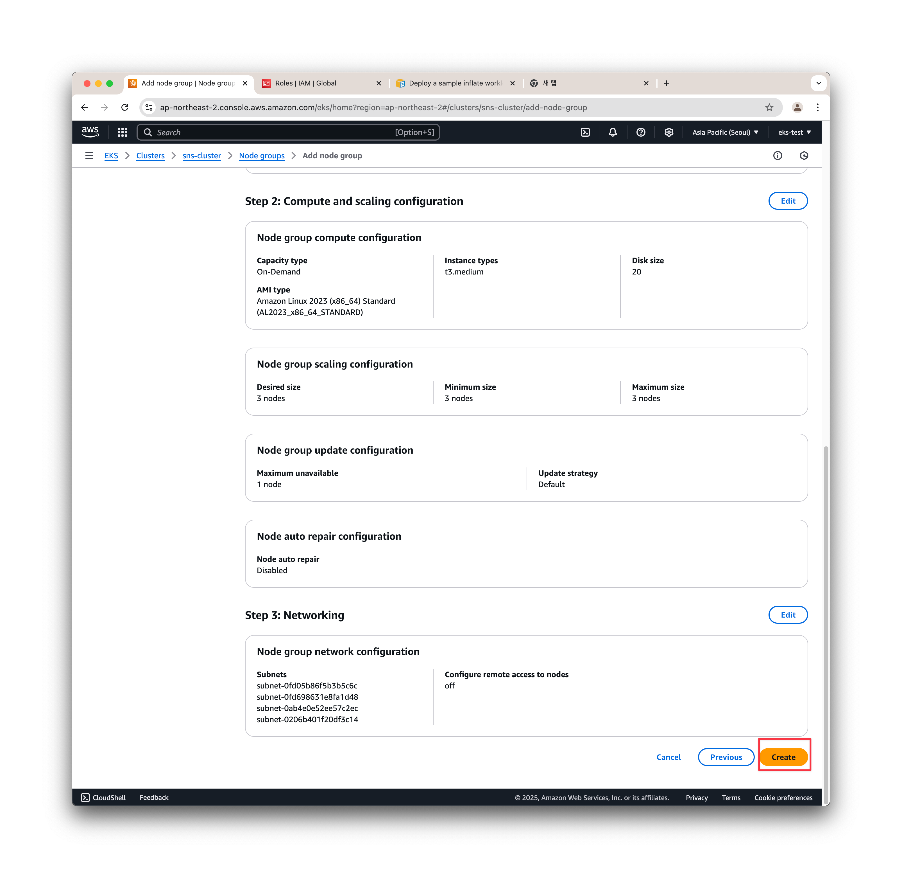

ì´í›„ ì„¤ì •ì„ í™•ì¸í•˜ê³  Create ë²„íŠ¼ì„ ëˆŒëŸ¬ 노드와 노드 ê·¸ë£¹ì„ ìƒì„±í•©ë‹ˆë‹¤.


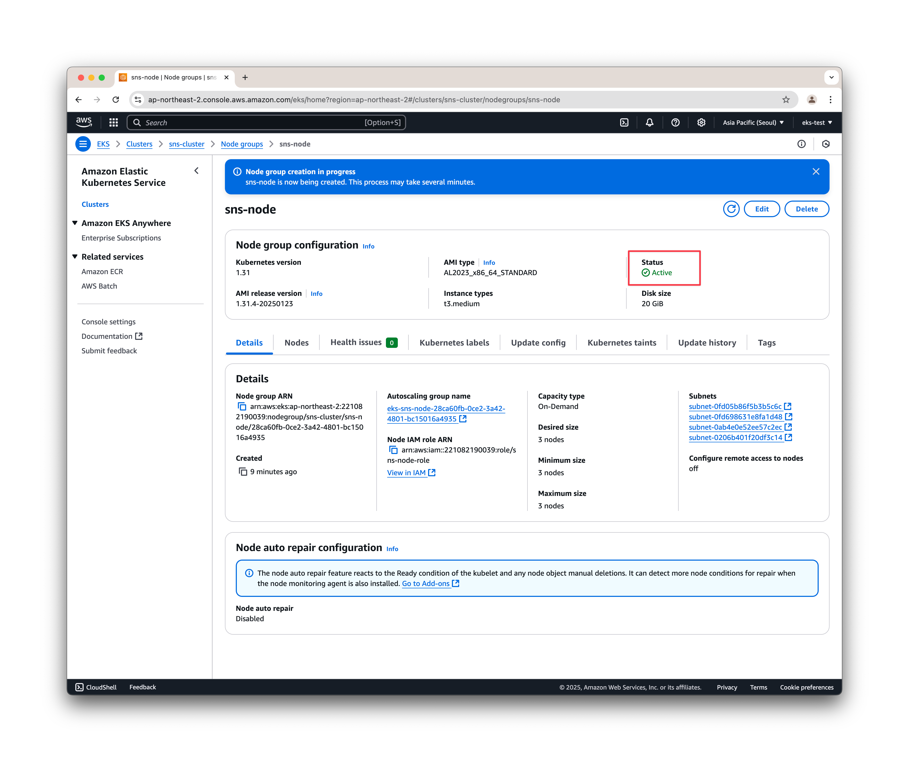

노드 ìƒì„± ì—­ì‹œ 다소 ì‹œê°„ì´ ê±¸ë¦½ë‹ˆë‹¤. ë…¸ë“œì˜ ìƒì„±ì€ ìƒí™©ì— ë”°ë¼ ë‹¤ì†Œ 다르지만 í´ëŸ¬ìŠ¤í„°ë‚˜ ì• ë“œì˜¨ì˜ ìƒì„±ë³´ë‹¤ëŠ” 오ë˜ê±¸ë¦¬ëŠ” í¸ì´ë©° ì¼ë°˜ì ìœ¼ë¡œ 10분 ì´ìƒ 소요ë©ë‹ˆë‹¤.

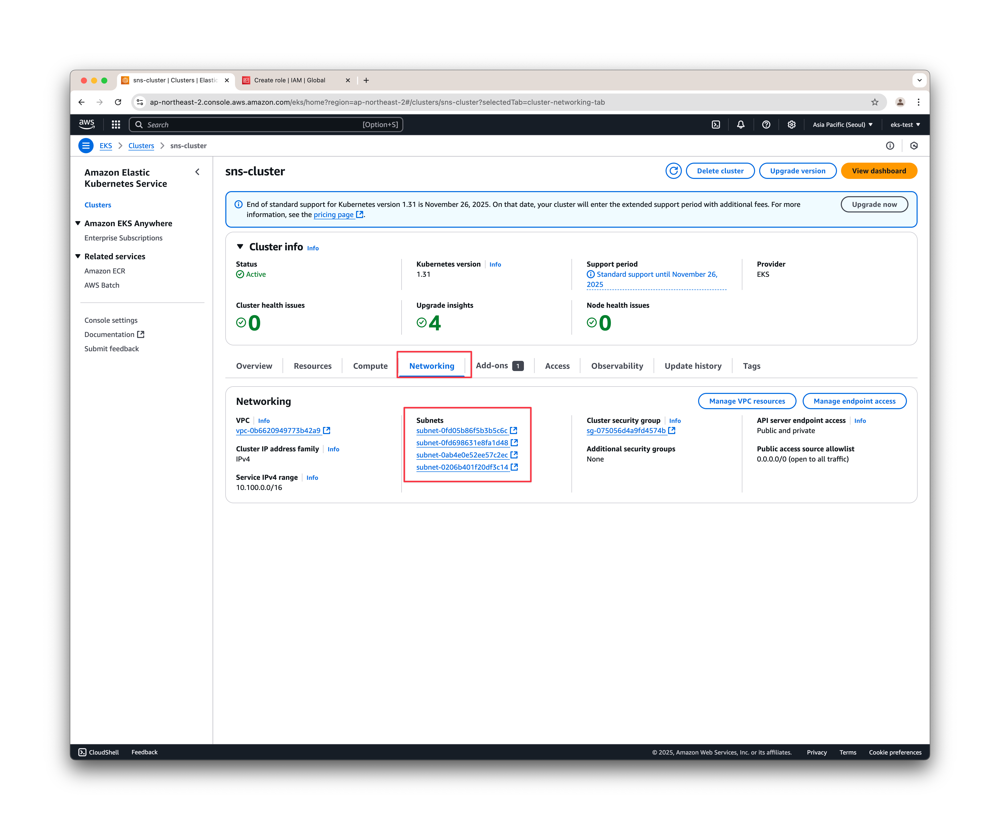

ì´í›„ ì¸ê·¸ë ˆìŠ¤ ì„¤ì •ì„ ìœ„í•´ ì„œë¸Œë„·ì— íƒœê·¸ë¥¼ 지정해주ë„ë¡ í•˜ê² ìŠµë‹ˆë‹¤. í´ëŸ¬ìŠ¤í„° 관리 í™”ë©´ì˜ Networking íƒ­ì„ ì„ íƒí•˜ê³  í‘œì‹œëœ ì„œë¸Œë„· 중 하나를 ì„ íƒí•´ì„œ 들어갑니다.


ì´í›„ Tags íƒ­ì„ ì„ íƒí•˜ê³  Manage tags를 눌러ì¤ë‹ˆë‹¤.


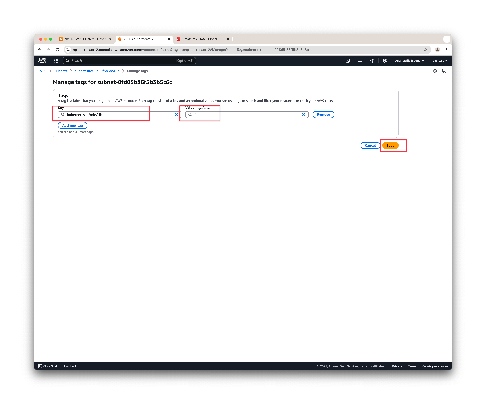

ì´í›„ Add new tag를 눌러주고 Keyì— [`kubernetes.io/role/elb`](http://kubernetes.io/role/elb) Valueì— `1` ì„ ì…력한 ë’¤ Save를 눌러ì¤ë‹ˆë‹¤. ì´ë¥¼ 모든 í¼ë¸”릭 ì„œë¸Œë„·ì— ë°˜ë³µí•˜ì—¬ 지정해ì¤ë‹ˆë‹¤. ë””í´íŠ¸ ì„œë¸Œë„·ì„ ì‚¬ìš©í•˜ëŠ” 경우 4ê°œì˜ ì„œë¸Œë„·ì´ ëª¨ë‘ í¼ë¸”릭 서브넷ì´ë¯€ë¡œ 모든 ì„œë¸Œë„·ì— íƒœê·¸ë¥¼ ì €ì¥í•´ì£¼ë©´ ë©ë‹ˆë‹¤.

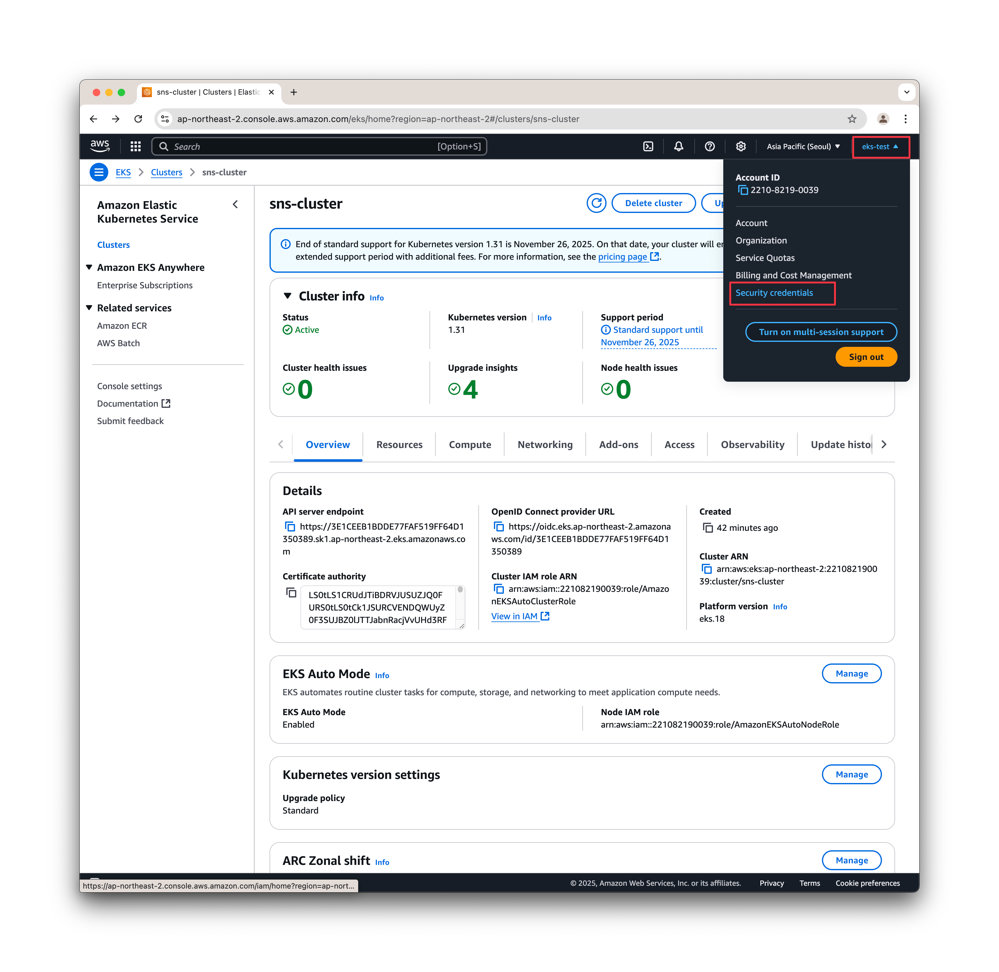

그리고 kubectl ëª…ë ¹ì„ ì‚¬ìš©í•˜ê¸° 위한 access key ì„¤ì •ì„ í•˜ê² ìŠµë‹ˆë‹¤. 루트 ê³„ì •ì¼ ê²½ìš° 우측 ìƒë‹¨ì˜ 계정명 누르고 Security credentials (보안 ì격 ì¦ëª…) ì„ íƒí•´ì£¼ì‹œê³ , 서브 ê³„ì •ì¼ ê²½ìš° 메뉴ì—ì„œ IAM 찾아서 들어간 ë’¤ Security credentials ì„ íƒí•´ì¤ë‹ˆë‹¤.

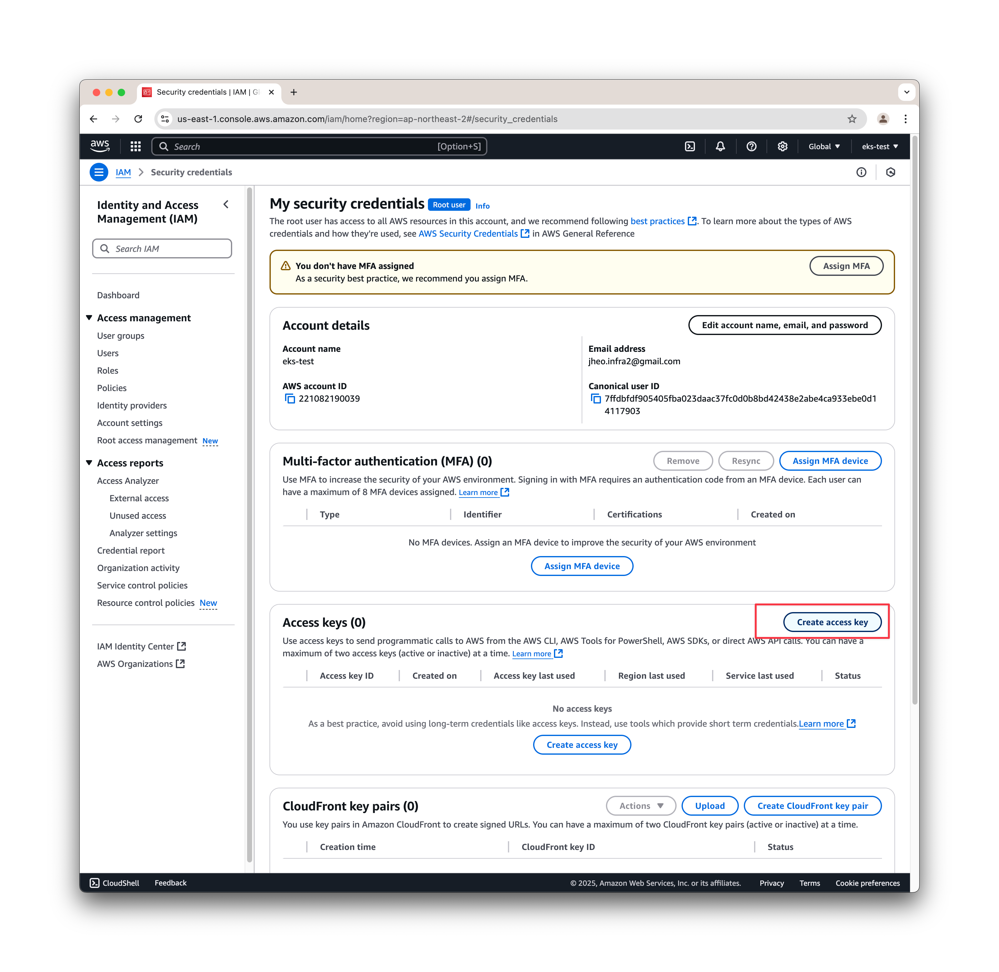

Access keys ì„¹ì…˜ì˜ Create access key를 ì„ íƒí•˜ì—¬ 새로운 엑세스 키를 ìƒì„±í•´ì¤ë‹ˆë‹¤.


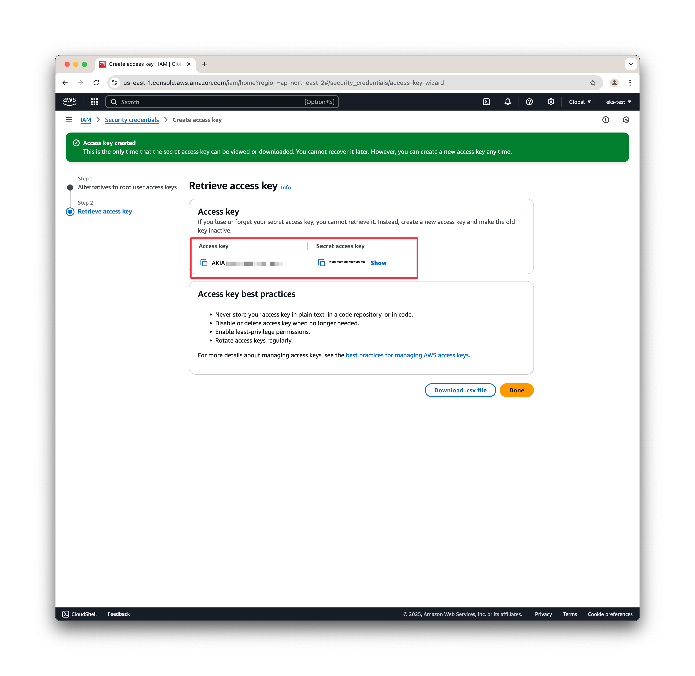

ì¼ë°˜ì ìœ¼ë¡œ 루트 ê³„ì •ì˜ Access key를 ìƒì„±í•˜ì—¬ 사용하는 ê²ƒì€ ê¶Œì¥ë˜ì§€ 않지만, 실습 í™˜ê²½ì˜ ê²½ìš° 해당 주ì˜ì‚¬í•­ì„ 확ì¸í•œ ë’¤ 키를 ìƒì„±í•´ì¤„ 수 ìˆìŠµë‹ˆë‹¤. ì´í›„ Access key와 Secretì´ ìƒì„±ëœ ê²ƒì„ í™•ì¸í•  수 ìˆìŠµë‹ˆë‹¤. 해당 키는 ì´ í™”ë©´ì—서만 확ì¸í•  수 ìˆìœ¼ë¯€ë¡œ 주ì˜í•´ì•¼ 합니다. 만약 ì´ í™”ë©´ì„ ê·¸ëƒ¥ 넘겨버린 경우 해당 키를 삭제하고 새로운 키를 ìƒì„±í•˜ì‹œë©´ ë©ë‹ˆë‹¤. 여기ì—ì„œ Access key와 Secretì„ í™•ì¸í•´ì¤ë‹ˆë‹¤. ì´ í‚¤ëŠ” 타ì¸ì—게 유출ë˜ì§€ ì•Šë„ë¡ ì£¼ì˜í•˜ì…”야 합니다.


터미ë„ì„ ì—´ê³  aws cli를 ì´ìš©í•˜ì—¬ aws configure ëª…ë ¹ì„ í†µí•´ 방금 ìƒì„±ëœ Access Key와 Secretì„ ì§€ì •í•´ì¤ë‹ˆë‹¤. 만약 ê¸°ì¡´ì— aws를 사용하고 계셨다면 새로운 계정으로 í™˜ê²½ì´ ë³€ê²½ë˜ë¯€ë¡œ 주ì˜í•˜ì…”야 합니다. aws cliê°€ 설치ë˜ì§€ ì•Šì€ ê²½ìš° ì•„ë˜ ê°€ì´ë“œë¥¼ 참조하여 설정해ì¤ë‹ˆë‹¤.

[https://docs.aws.amazon.com/ko_kr/eks/latest/userguide/install-awscli.html](https://docs.aws.amazon.com/ko_kr/eks/latest/userguide/install-awscli.html)

ë˜í•œ ì‹¤ìŠµì„ ìœ„í•´ì„œ kubectl ì˜ ì„¤ì¹˜ê°€ 필요하므로, 마찬가리조 kubectlì´ ì„¤ì¹˜ë˜ì§€ ì•Šì€ ìƒíƒœë¼ë©´ ì•„ë˜ ê°€ì´ë“œë¥¼ 참조하여 kubectlì„ ì„¤ì¹˜í•´ì¤ë‹ˆë‹¤. 만약 ê¸°ì¡´ì— kubectlì„ ì„¤ì¹˜í•´ì„œ 사용하는 경우, 해당 kubectl ë²„ì „ì´ êµ¬ë²„ì „ì´ë¼ë©´ (ìƒì„±í•œ í´ëŸ¬ìŠ¤í„°ì— 비해서 ë²„ì „ì´ ë§ì´ ì°¨ì´ë‚˜ëŠ” 경우) ì—­ì‹œ ì¬ì„¤ì¹˜ê°€ 필요합니다.

[https://docs.aws.amazon.com/ko_kr/eks/latest/userguide/install-kubectl.html](https://docs.aws.amazon.com/ko_kr/eks/latest/userguide/install-kubectl.html)

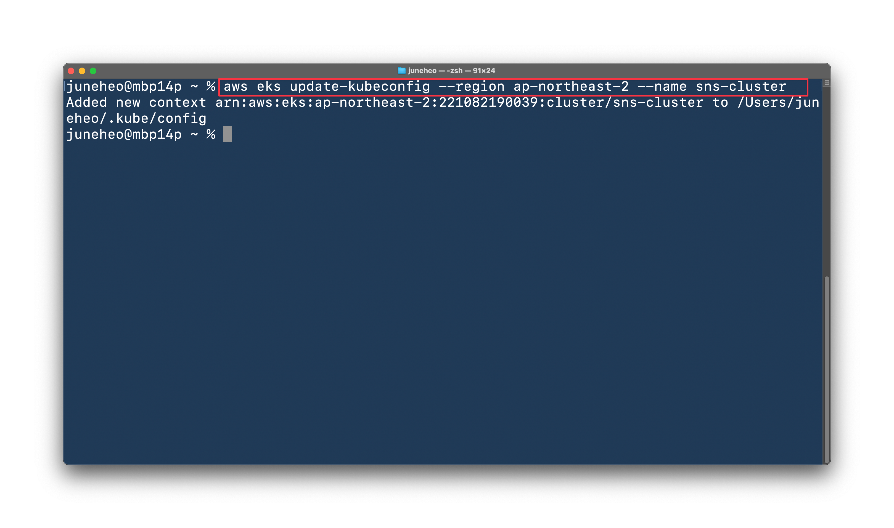

ì´í›„ `aws eks update-kubeconfig —region ap-northeast-2 —name sns-cluster` ëª…ë ¹ì„ ì…력하여 로컬 터미ë„ì˜ kubectl 명령어를 방금 ìƒì„±í•œ í´ëŸ¬ìŠ¤í„°ì™€ ì—°ê²°í•´ì¤ë‹ˆë‹¤. 


kubectl version ëª…ë ¹ì„ í†µí•´ í´ëŸ¬ìŠ¤í„°ê°€ ì •ìƒì ìœ¼ë¡œ ì—°ê²°ëœ ê²ƒì„ í™•ì¸í•©ë‹ˆë‹¤.

## 💾 EFS 스토리지 설정

### 개요
EFS(Elastic File System)는 여러 가용ì˜ì—­ì— ë¶„ì‚°ëœ ë…¸ë“œ ê°„ì— íŒŒì¼ì„ 공유하기 위한 설정ì…니다. 프로ì íŠ¸ í•™ìŠµì— ì§‘ì¤‘í•˜ê³  싶다면 ì´ ì„¤ì •ì„ ê±´ë„ˆë›¸ 수 ìˆìŠµë‹ˆë‹¤.

### 🚀 ìë™ ì„¤ì • (권ì¥)
ê°œì„ ëœ ìŠ¤í¬ë¦½íŠ¸ë¥¼ 사용하여 EFS를 ìë™ìœ¼ë¡œ 설정할 수 ìˆìŠµë‹ˆë‹¤.

```bash
cd infra/script

# 기본 설정 (sns-cluster, ap-northeast-2)
./storage/setup-efs.sh

# 특정 í´ëŸ¬ìŠ¤í„°ì™€ 지역 지정
./storage/setup-efs.sh my-cluster us-west-2

# ë„ì›€ë§ ë³´ê¸°
./storage/setup-efs.sh help
```

### ✨ 스í¬ë¦½íŠ¸ 개선사항
- **안전한 ì¬ì‹¤í–‰**: 기존 리소스 ì¡´ì¬ ì‹œ ì—러 대신 ì ì ˆí•œ 메시지 출력 후 진행
- **ë™ì  설정**: OIDC Provider ID와 AWS 계정 ID를 ìë™ìœ¼ë¡œ 가져와서 사용
- **중복 ìƒì„± 방지**: EFS íŒŒì¼ ì‹œìŠ¤í…œ, Access Point, IAM ì •ì±…/ì—­í•  중복 ìƒì„± 방지
- **ìƒíƒœ 확ì¸**: ê° ë‹¨ê³„ë³„ë¡œ 기존 리소스 사용 여부를 ëª…í™•íˆ í‘œì‹œ

### 📋 설정 내용
스í¬ë¦½íŠ¸ëŠ” ë‹¤ìŒ ë¦¬ì†ŒìŠ¤ë“¤ì„ ìë™ìœ¼ë¡œ ìƒì„±/설정합니다:

1. **EFS íŒŒì¼ ì‹œìŠ¤í…œ**: 공유 스토리지 ìƒì„±
2. **EFS 보안 그룹**: í´ëŸ¬ìŠ¤í„°ì™€ì˜ í†µì‹ ì„ ìœ„í•œ 보안 규칙
3. **EFS 마운트 타겟**: ê° ì„œë¸Œë„·ì— ë§ˆìš´íŠ¸ í¬ì¸íŠ¸ ìƒì„±
4. **EFS Access Point**: íŒŒì¼ ì‹œìŠ¤í…œ ì ‘ê·¼ì„ ìœ„í•œ 엔드í¬ì¸íŠ¸
5. **IAM ì •ì±… ë° ì—­í• **: EFS CSI Driver를 위한 권한 설정
6. **Kubernetes 리소스**: StorageClass, PVC, ServiceAccount 등

### 🔧 설정 í™•ì¸ ë° ê´€ë¦¬

#### 설정 ìƒíƒœ 확ì¸
```bash
# StorageClass 확ì¸
kubectl get storageclass

# PVC ìƒíƒœ 확ì¸
kubectl get pvc -n sns

# EFS CSI Driver ìƒíƒœ 확ì¸
kubectl get pods -n kube-system -l app=efs-csi-node

# EFS 마운트 타겟 확ì¸
aws efs describe-mount-targets --file-system-id <EFS_ID> --region ap-northeast-2
```

#### EFS 정리 (필요시)
```bash
# EFS 리소스 정리
./storage/cleanup-efs.sh

# 특정 í´ëŸ¬ìŠ¤í„°ì™€ 지역 지정
./storage/cleanup-efs.sh my-cluster us-west-2
```

### 📠설정 íŒŒì¼ ìœ„ì¹˜
```
infra/script/
├── configs/
│   ├── efs-setup.yaml          # EFS Kubernetes 설정
│   └── efs-csi-policy.json     # EFS CSI Driver IAM 정책
├── storage/
│   ├── setup-efs.sh            # EFS 설정 스í¬ë¦½íŠ¸
│   └── cleanup-efs.sh          # EFS 정리 스í¬ë¦½íŠ¸
└── ...
```

### ìˆ˜ë™ ì„¤ì • 대안
EFS ì„¤ì •ì„ ê±´ë„ˆë›°ëŠ” 경우, ì´ë¯¸ì§€ 서버 ë°°í¬ ì‹œ 다ìŒê³¼ ê°™ì´ `emptyDir`를 사용하세요:

```yaml
apiVersion: apps/v1
kind: Deployment
metadata:
  name: image-server
  namespace: sns
spec:
  replicas: 1  # âš ï¸ EFS 미사용 ì‹œ 반드시 1개로 설정
  template:
    spec:
      containers:
        - name: image-container
          image: {ecr주소}/image-server:0.0.1
          volumeMounts:
            - name: image-volume
              mountPath: /app/uploads
      volumes:
        - name: image-volume
          emptyDir: {}  # EFS 대신 ì„ì‹œ 스토리지 사용
```

> âš ï¸ **주ì˜**: `emptyDir` 사용 ì‹œ ì´ë¯¸ì§€ ì„œë²„ì˜ replicas는 반드시 1개로 설정해야 합니다.

## 🌠EKS ì율 모드 ì¸ê·¸ë ˆìŠ¤ 설정

### ìë™ ë¡œë“œë°¸ëŸ°ì„œ 설정
EKS ì율 모드로 í´ëŸ¬ìŠ¤í„°ë¥¼ ìƒì„±í•œ 경우, 별ë„ì˜ ë¡œë“œë°¸ëŸ°ì„œ 설정 ì—†ì´ Ingress Class를 ìƒì„±í•˜ì—¬ ì¸ê·¸ë ˆìŠ¤ë¥¼ ìë™ìœ¼ë¡œ 설정할 수 ìˆìŠµë‹ˆë‹¤.

### Ingress Class ìƒì„±
```yaml
apiVersion: networking.k8s.io/v1
kind: IngressClass
metadata:
  namespace: sns
  labels:
    app.kubernetes.io/name: LoadBalancerController
  name: alb 
spec:
  controller: eks.amazonaws.com/alb
```

### ì ìš© 방법
```bash
kubectl apply -f ingress-class.yaml
```

### 참고 ì료
- [AWS EKS ìë™ ë¡œë“œë°¸ëŸ°ì„œ ê°€ì´ë“œ](https://docs.aws.amazon.com/ko_kr/eks/latest/userguide/auto-elb-example.html)

> âš ï¸ **주ì˜**: í´ëŸ¬ìŠ¤í„° ìƒì„± ì‹œ í¼ë¸”릭 ì„œë¸Œë„·ì— `kubernetes.io/role/elb` 태그를 지정하지 않으면 ì¸ê·¸ë ˆìŠ¤ê°€ ì •ìƒì ìœ¼ë¡œ 설정ë˜ì§€ ì•Šì„ ìˆ˜ ìˆìŠµë‹ˆë‹¤.
>

## 📚 추가 참고 ì료

> 💡 **참고**: ì•„ë˜ ê°€ì´ë“œëŠ” EKS ì율 모드를 사용하지 않는 전통ì ì¸ ì„¤ì •ì— ëŒ€í•œ ê°€ì´ë“œì…니다. ìœ„ì˜ ì율 모드 ì„¤ì •ì´ ì™„ë£Œëœ ê²½ìš° ì•„ë˜ ë‚´ìš© 중 í´ëŸ¬ìŠ¤í„° ìƒì„± ë¶€ë¶„ì€ ê±´ë„ˆë›°ì…”ë„ ë©ë‹ˆë‹¤.

## 🔧 전통ì ì¸ EKS 설정 (ì율 모드 미사용)

### IAM Role ìƒì„±
- eks-cluster-role
  - IAM - Roles - Create Role
  - AWS Serviceì—ì„œ EKS - Cluster Use Case ì„ íƒ
  - Add Permissionì—ì„œ AmazonEKSClusterPolicy 추가ë˜ì–´ ìˆëŠ” 것 확ì¸í•˜ê³  Next
  - Create Role 눌러서 ìƒì„± 완료
- eks-node-role
  - IAM - Roles - Create Role
  - AWS Serviceì—ì„œ EC2 ì„ íƒ
  - Add Permissionì—ì„œ ë‹¤ìŒ 3가지 Permission 추가
    - AmazonEC2ContainerRegistryReadOnly
    - EKSWorkerNodePolicy
    - EKSCniPolicy
  - Create Role 눌러서 ìƒì„± 완료

### Access Key 설정
- User - í˜„ì¬ ê³„ì • ì„ íƒ
- Security Credentials - Access Key
- Create Access Key
- Use Caseì—ì„œ CLI ì„ íƒ
- Access Key / Secret Key ìƒì„±
- `aws configure`명령으로 Access Key , Secret Key 설정하여 CLI 설정

### EKS Cluster ìƒì„±
- Region í™•ì¸ (í•œêµ­ì˜ ê²½ìš° ap-northeast-2 서울 리전 ì„ íƒ)
- EKS - Add Cluster - Create
- Cluster ì´ë¦„ : sns-cluster
- Cluster Service Role : eks-cluster-role
- 다른 ì„¤ì •ì€ ëª¨ë‘ ê¸°ë³¸ê°’ 사용하여 ìƒì„±
  - 별ë„ì˜ VPC ì„¤ì •ì´ ìˆëŠ” 경우 해당 VPCì— ì„¤ì •
- í´ëŸ¬ìŠ¤í„° ìƒì„± 후 Active ìƒíƒœê°€ ë ë•Œê¹Œì§€ 기다리기

### EKS Node Group ìƒì„±
- ìƒì„±ëœ í´ëŸ¬ìŠ¤í„°ì—ì„œ Compute - Add node group
- Node group ì´ë¦„ : sns-node
- Node IAM role : eks-node-role
- AMI type : Amazon Linux 2 (x86_64)
- Instance Type : t3.medium
- Desired, Minimum, Maximum size : 2
- ìƒì„± 후 노드 추가 완료ë ë•Œê¹Œì§€ ì ì‹œ 기다리기

### kubectl 컨í…스트 추가
- `aws eks update-kubeconfig --region ap-northeast-2 --name sns-cluster`
- `kubectl get nodes` 명령어로 실제 노드 ëª©ë¡ ë‚˜ì˜¤ëŠ”ì§€ 확ì¸

### 참고
[AWS EKS 설치 ê°€ì´ë“œ](https://docs.aws.amazon.com/ko_kr/eks/latest/userguide/getting-started-console.html)

## 🚀 고급 설정 ë° ëª¨ë‹ˆí„°ë§

### 스í¬ë¦½íŠ¸ 활용 ê°€ì´ë“œ

#### 1. ë„¤íŠ¸ì›Œí¬ ì •ë³´ 확ì¸
```bash
cd infra/script
./utils/get_network_info.sh sns-cluster ap-northeast-2
```

#### 2. EFS ìƒíƒœ 모니터ë§
```bash
./utils/check_efs_status.sh
```

#### 3. Fargate ìƒíƒœ 확ì¸
```bash
./utils/check_fargate_status.sh
```

#### 4. 통합 관리
```bash
./core/manage_storage.sh help
./core/manage_storage.sh check-status
```

### 🔠문제 해결

#### ì¼ë°˜ì ì¸ 문제들
1. **kubectl ì—°ê²° 실패**: `aws eks update-kubeconfig` ì¬ì‹¤í–‰
2. **EFS 마운트 실패**: 보안 그룹 규칙 확ì¸
3. **Fargate Pod Pending**: Fargate í”„ë¡œíŒŒì¼ ì„¤ì • 확ì¸

#### 로그 확ì¸
```bash
# í´ëŸ¬ìŠ¤í„° ìƒíƒœ 확ì¸
kubectl get nodes
kubectl get pods -A

# EFS CSI Driver 로그
kubectl logs -n kube-system -l app=efs-csi-node

# Fargate Pod 로그
kubectl logs -n sns deployment/image-server-fargate
```

## ğŸ“ ì§€ì› ë° ë¬¸ì˜

문제가 ë°œìƒí•˜ê±°ë‚˜ 추가 ë„ì›€ì´ í•„ìš”í•œ 경우:
1. AWS EKS ê³µì‹ ë¬¸ì„œ 참조
2. 프로ì íŠ¸ ì´ìŠˆ 트ë˜ì»¤ 활용
3. 커뮤니티 í¬ëŸ¼ 검색

---

**마지막 ì—…ë°ì´íŠ¸**: 2025ë…„ 1ì›”

## 🔧 ìˆ˜ë™ EFS 설정 (고급 사용ììš©)

> âš ï¸ **참고**: ìœ„ì˜ ìë™ ì„¤ì • 스í¬ë¦½íŠ¸ë¥¼ 사용하는 ê²ƒì„ ê¶Œì¥í•©ë‹ˆë‹¤. ìˆ˜ë™ ì„¤ì •ì€ ê³ ê¸‰ 사용ì나 특별한 ìš”êµ¬ì‚¬í•­ì´ ìˆëŠ” 경우ì—만 사용하세요.

### IAM Role ìƒì„±
- EKS - clusterì—ì„œ sns-cluster ì„ íƒ
- OpenID Connect provider URL 복사
- IAM - Identity Providersì—ì„œ OpenID Connect ì„ íƒ
- Provider URLì— EKSì—ì„œ 복사한 OpenID URL 붙여넣고 Get Thumbprint í´ë¦­
- Audienceì— `sts.amazonaws.com` ì…ë ¥
- Add Provider 눌러서 ìƒì„±
- IAM - Roles - Create Role
- Web Identity ì„ íƒ
- Identity Providerì—ì„œ OpenID URL ì„ íƒ
- Audienceì—ì„œ sts.amazonaws.com ì„ íƒ í›„ Next
- Permissionì—ì„œ AmazonEFSCSIDriverPolicy 검색해서 ì„ íƒ í›„ Next
- AmazonEKS_EFS_CSI_DriverRole으로 Role ì´ë¦„ 주고 ìƒì„±
- IAM - Rolesì—ì„œ AmazonEKS_EFS_CSI_DriverRole ì„ íƒí•˜ê³  Trust Relationships 탭ì—ì„œ Edit Trust Policy ì„ íƒ
- Conditionì—ì„œ `"oidc.eks.ap-northeast-2.amazonaws.com/id/OOOOOOOO:aud": "sts.amazonaws.com"`ë¡œ ì‹œì‘하는 í•œ 줄 복사해서 ë¶™ì—¬ë„£ì€ ë‹¤ìŒì— `"oidc.eks.ap-northeast-2.amazonaws.com/id/OOOOOOOO:sub": "system:serviceaccount:kube-system:efs-csi-*"`와 ê°™ì€ í˜•íƒœë¡œ 변경
  - `aud`를 `sub`로,
  - `sts.amazonaws.com`ì„ `system:serviceaccount:kube-system:efs-csi-*` 으로 변경
  - 최종ì ìœ¼ë¡œ aud, sub 2ê°œì˜ ì»¨ë””ì…˜ì´ ìˆì–´ì•¼ 함
- Conditionì˜ `StringEquals`를 `StringLike`으로 변경 후 ì €ì¥

### VPC Security Group 수정
- VPC - Security Group
- í´ëŸ¬ìŠ¤í„°ì—ì„œ 사용하는 Security Group ì„ íƒ
  - 별다른 ì„¤ì •ì„ í•˜ì§€ ì•Šì•˜ì„ ê²½ìš° Default Security Group
- Inbound Rulesì—ì„œ Edit Inbound Ruleì„ íƒ
- í´ëŸ¬ìŠ¤í„°ì˜ ì„œë¸Œë„·ì´ ì‚¬ìš©í•˜ëŠ” ëŒ€ì—­ì— ëŒ€í•´ NFS(2049) í¬íŠ¸ 추가 후 ì €ì¥
  - 별다른 ì„¤ì •ì„ í•˜ì§€ ì•Šì€ ê²½ìš° 172.31.0.0/16

### EFS Add-On 추가
- EKS - clusters - sns-cluster ì„ íƒ
- Add-on 탭ì—ì„œ Get more add-ons í´ë¦­
- Amazon EFS CSI Driver ì„ íƒ í›„ 설치
  - Roleì€ ë°˜ë“œì‹œ AmazonEKS_EFS_CSI_DriverRole ì„ íƒ

### EFS FileSystem ìƒì„±
- EFS - File Systems - Create File System
  - ì´ë¦„ : efs-volume
  - VPC : sns-clusterê°€ ì„¤ì¹˜ëœ VPC
- ìƒì„± 후 File system ID 복사

### Storage í´ë˜ìŠ¤ 추가

- 다ìŒê³¼ ê°™ì´ StorageClass íŒŒì¼ ìƒì„±
- fileSystemId는 EFSì—ì„œ 복사한 IDë¡œ 추가

```yaml
kind: StorageClass
apiVersion: storage.k8s.io/v1
metadata:
  name: efs-sc
provisioner: efs.csi.aws.com
parameters:
  provisioningMode: efs-ap
  fileSystemId: [EFS 파ì¼ì‹œìŠ¤í…œ ID]
  directoryPerms: "700"
```

- `kubectl apply -f efs-sc.yaml` 명령어로 StorageClass ìƒì„±

### 참고 ì료
- [EFS CSI Driver 설치 ê°€ì´ë“œ](https://docs.aws.amazon.com/ko_kr/eks/latest/userguide/efs-csi.html)
- [AWS EKS EFS ê°€ì´ë“œ](https://docs.aws.amazon.com/ko_kr/eks/latest/userguide/efs-csi.html)

## MySQL DB 설정

### RDS Database ìƒì„±
- RDS - Create database
- Easy create - MySQL
- DB Instance size : Free Tier
- DB instance identifier : sns-db
- Master username : admin
- Master password : ì„ì˜ì˜ 비밀번호
- RDS ìƒì„± 기다린 ë’¤, Security Group ì„ íƒ
- Inbound rules - Edit inbound rules
- MYSQL/Aurora í¬íŠ¸ì— 대해서 172.31.0.0/16 í˜¹ì€ eks security group 추가 후 ì €ì¥

### Schema ìƒì„±

- mysql í´ë¼ì´ì–¸íŠ¸ 파드 ìƒì„±
```
kubectl run mysql-client --image=mysql:8 -it --rm -- bash
```
- mysql í´ë¼ì´ì–¸íŠ¸ 실행
```
mysql -h [RDS Endpoint] -u admin -p
(패스워드 ì…ë ¥)
```
- DDL 실행
```sql
create database sns;
use sns;

create user 'sns-server'@'%' identified by 'password!';
grant all privileges on sns.* to 'sns-server'@'%';

create table social_feed
(
    feed_id         int auto_increment
        primary key,
    image_id        varchar(255)                       not null,
    uploader_id     int                                not null,
    upload_datetime datetime default CURRENT_TIMESTAMP null,
    contents        text                               null
);

create table user
(
    user_id  int auto_increment
        primary key,
    username varchar(255) not null,
    email    varchar(255) not null,
    password varchar(255) not null
);

create table follow
(
    follow_id       int auto_increment
        primary key,
    user_id         int                                not null,
    follower_id     int                                not null,
    follow_datetime datetime default CURRENT_TIMESTAMP null
);
```

## Redis, Kafka, DB Service 설치
- Namespace
```sh
kubectl create namespace infra
```

- Redis
```sh
helm -n infra install redis oci://registry-1.docker.io/bitnamicharts/redis --set architecture=standalone --set auth.enabled=false --set master.persistence.enabled=false
```

- Kafka
```sh
helm -n infra install kafka oci://registry-1.docker.io/bitnamicharts/kafka --set controller.replicaCount=3  --set sasl.client.passwords=kafkakafka123! --set controller.persistence.enabled=false --set broker.persistence.enabled=false
```

### External Name Service 설정

```yaml
apiVersion: v1
kind: Service
metadata:
  name: mysql
  namespace: infra
spec:
  type: ExternalName
  externalName: [RDS MySQL DB주소]
```

### ECR Repository ìƒì„±
- ECR - private registry - Repositories - Create Repository
- 다ìŒê³¼ ê°™ì´ Private ì €ì¥ì†Œ ìƒì„±
  - feed-server
  - user-server
  - image-server
  - notification-batch
  - timeline-server
  - sns-frontend
- ê° ì €ì¥ì†Œì— 대해 Create Repository 눌러서 ìƒì„± 완료

## Chapter 6 : Monitoring

### metrics-server 설치

- https://github.com/kubernetes-sigs/metrics-serverì—ì„œ 설치 방법 í™•ì¸ ê°€ëŠ¥
```sh
kubectl apply -f https://github.com/kubernetes-sigs/metrics-server/releases/latest/download/components.yaml
```

### Prometheus와 Grafana 설치

- Helm Repository 추가
```sh
helm repo add prometheus-community https://prometheus-community.github.io/helm-charts
helm repo add grafana https://grafana.github.io/helm-charts
```

- Namespace ìƒì„±
```sh
kubectl create namespace monitoring
```

- Prometheus 설치
```sh
helm install prometheus prometheus-community/prometheus --namespace monitoring  --set server.persistentVolume.enabled=false --set alertmanager.persistence.enabled=false
```

- grafana.yaml ìƒì„±
```yaml
datasources:
  datasources.yaml:
    apiVersion: 1
    datasources:
    - name: Prometheus
      type: prometheus
      url: http://prometheus-server.monitoring.svc.cluster.local
      access: proxy
      isDefault: true
```
- Grafana 설치
```sh
helm install grafana grafana/grafana  --namespace monitoring --set persistence.enabled=false --set adminPassword="admin01" --values ./grafana.yaml
```

### OpenLens 설치
- https://github.com/MuhammedKalkan/OpenLens/ ì—ì„œ 릴리즈 다운로드 

### KubeCost 설치
```sh
helm upgrade -i kubecost oci://public.ecr.aws/kubecost/cost-analyzer --version 1.108.1 \
    --namespace monitoring --set persistentVolume.enabled=false --set prometheus.server.persistentVolume.enabled=false \
    -f https://raw.githubusercontent.com/kubecost/cost-analyzer-helm-chart/develop/cost-analyzer/values-eks-cost-monitoring.yaml
```
- port-fowarding
```yaml
kubectl port-forward --namespace monitoring deployment/kubecost-cost-analyzer 9090
```

## Chapter 7: 성능 테스트 ë° í…ŒìŠ¤íŠ¸ ë°ì´í„° 추가

### k6 설치
- https://k6.io ì—ì„œ 다운로드 후 설치

### 테스트 ë°ì´í„° 추가
```sh
git clone https://github.com/dev-online-k8s/part3-testdatagen.git
```

```sh
SNS_DATA_GENERATOR_TELEPRESENCE_ENABLED=true java -jar TestDataGen.jar
```

### Frontend Deploy ë°°í¬

```sh
docker pull jheo/sns-frontend:1.0.0
docker tag jheo/sns-frontend:1.0.0 {ecr주소}/sns-frontend:1.0.0
docker push {ecr주소}/sns-frontend:1.0.0
```
- pushì—ì„œ ì¸ì¦ 오류 ë°œìƒ ì‹œ ECRì˜ View push command 버튼 눌러서 ë¡œê·¸ì¸ ë°©ë²• 수행
  - aws ecr get-login-password --region ap-northeast-2 | docker login --username AWS --password-stdin {account id}.dkr.ecr.ap-northeast-2.amazonaws.com

- Deployment와 Service ìƒì„± ë° ë°°í¬
```yaml
apiVersion: apps/v1
kind: Deployment
metadata:
  name: sns-frontend
  namespace: sns
spec:
  replicas: 1
  selector:
    matchLabels:
      app: sns-frontend
  template:
    metadata:
      labels:
        app: sns-frontend
    spec:
      containers:
        - name: sns-frontend-container
          image: {ecr주소}/sns-frontend:1.0.0
```

```yaml
apiVersion: v1
kind: Service
metadata:
  name: sns-frontend-service
  namespace: sns
spec:
  selector:
    app: sns-frontend
  ports:
    - protocol: TCP
      port: 3000
```

### Ingress Controller 설치
- https://docs.aws.amazon.com/ko_kr/eks/latest/userguide/alb-ingress.html
- https://docs.aws.amazon.com/ko_kr/eks/latest/userguide/aws-load-balancer-controller.html


