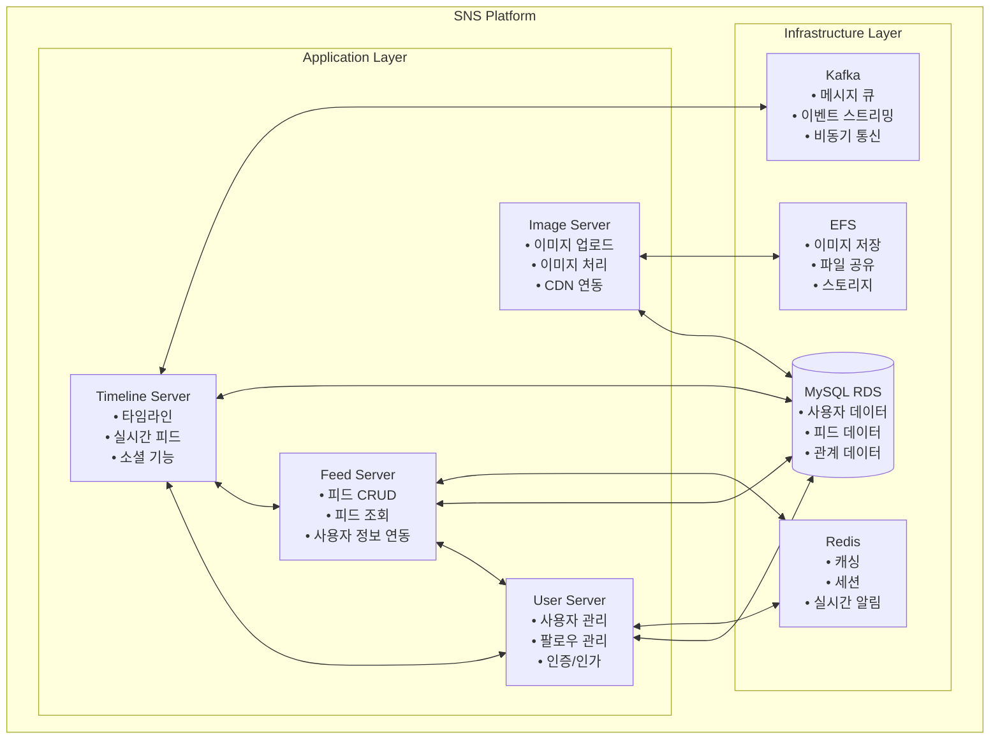
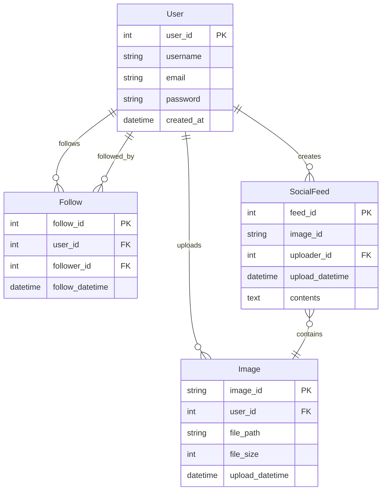

# SNS Project - 마이크로서비스 아키텍처

이 문서는 SNS 프로젝트의 마이크로서비스 아키텍처와 각 서비스의 구조를 설명합니다.

## 📋 목차
1. [아키텍처 개요](#1-아키텍처-개요)
2. [서비스 구조](#2-서비스-구조)
3. [데이터베이스 설계](#3-데이터베이스-설계)
4. [API 문서](#4-api-문서)
5. [배포 가이드](#5-배포-가이드)
6. [개발 가이드](#6-개발-가이드)
7. [모니터링 및 로깅](#7-모니터링-및-로깅)

---

## 1. 아키텍처 개요

### 1.1 전체 아키텍처



### 1.2 기술 스택
- **Backend**: Spring Boot 3.2.1, Java 21
- **Database**: MySQL 8.0 (RDS)
- **Cache**: Redis 6
- **Message Queue**: Apache Kafka 4.0 (KRaft 모드)
- **Storage**: AWS EFS
- **Container**: Docker
- **Orchestration**: Kubernetes (EKS)
- **Build Tool**: Gradle

### 1.3 마이크로서비스 통신
- **동기 통신**: HTTP REST API
- **비동기 통신**: Kafka 메시지 큐
- **서비스 디스커버리**: Kubernetes Service
- **로드 밸런싱**: Kubernetes Service LoadBalancer

---

## 2. 서비스 구조

### 2.1 Feed Server (`feed-server/`)
피드 관리 및 조회를 담당하는 핵심 서비스

#### 주요 기능
- 피드 생성, 조회, 수정, 삭제 (CRUD)
- 사용자별 피드 조회
- 팔로우한 사용자의 피드 조회
- 피드 좋아요/댓글 기능

#### API 엔드포인트
```
POST   /api/feeds          - 피드 생성
GET    /api/feeds          - 피드 목록 조회
GET    /api/feeds/{id}     - 특정 피드 조회
PUT    /api/feeds/{id}     - 피드 수정
DELETE /api/feeds/{id}     - 피드 삭제
GET    /api/feeds/user/{userId} - 사용자별 피드 조회
```

#### 주요 클래스
- `SocialFeedController`: REST API 컨트롤러
- `SocialFeedService`: 비즈니스 로직 서비스
- `SocialFeedRepository`: 데이터 접근 계층
- `SocialFeed`: JPA 엔티티
- `FeedInfo`: 응답 DTO (사용자 정보 포함)
- `FeedRequest`: 요청 DTO

#### 데이터베이스
- **테이블**: `social_feed`
- **필드**: `feed_id`, `image_id`, `uploader_id`, `upload_datetime`, `contents`

### 2.2 User Server (`user-server/`)
사용자 관리 및 팔로우 기능을 담당하는 서비스

#### 주요 기능
- 사용자 등록, 조회, 수정, 삭제 (CRUD)
- 팔로우/언팔로우 관리
- 사용자 인증 및 인가
- 사용자 프로필 관리

#### API 엔드포인트
```
# 사용자 관리
POST   /api/users          - 사용자 등록
GET    /api/users          - 사용자 목록 조회
GET    /api/users/{id}     - 특정 사용자 조회
PUT    /api/users/{id}     - 사용자 정보 수정
DELETE /api/users/{id}     - 사용자 삭제

# 팔로우 관리
POST   /api/follows        - 팔로우 생성
DELETE /api/follows        - 언팔로우
GET    /api/follows/followers/{userId} - 팔로워 목록
GET    /api/follows/following/{userId} - 팔로잉 목록
```

#### 주요 클래스
- `UserController`: 사용자 API 컨트롤러
- `UserService`: 사용자 비즈니스 로직
- `UserRepository`: 사용자 데이터 접근
- `User`: 사용자 엔티티
- `FollowController`: 팔로우 API 컨트롤러
- `FollowService`: 팔로우 비즈니스 로직
- `FollowRepository`: 팔로우 데이터 접근
- `Follow`: 팔로우 엔티티

#### 데이터베이스
- **테이블**: `user`, `follow`
- **User 필드**: `user_id`, `username`, `email`, `password`
- **Follow 필드**: `follow_id`, `user_id`, `follower_id`, `follow_datetime`

### 2.3 Image Server (`image-server/`)
이미지 업로드 및 관리를 담당하는 서비스

#### 주요 기능
- 이미지 업로드 및 저장
- 이미지 리사이징 및 최적화
- 이미지 메타데이터 관리
- CDN 연동

#### API 엔드포인트
```
POST   /api/images/upload  - 이미지 업로드
GET    /api/images/{id}    - 이미지 조회
DELETE /api/images/{id}    - 이미지 삭제
GET    /api/images/user/{userId} - 사용자별 이미지 목록
```

#### 주요 클래스
- `ImageController`: 이미지 API 컨트롤러
- `ImageService`: 이미지 처리 서비스
- `ImageRepository`: 이미지 메타데이터 저장
- `Image`: 이미지 엔티티

#### 스토리지
- **파일 저장**: AWS EFS
- **메타데이터**: MySQL 데이터베이스
- **CDN**: AWS CloudFront (선택사항)

### 2.4 Timeline Server (`timeline-server/`)
실시간 타임라인 및 소셜 기능을 담당하는 서비스

#### 주요 기능
- 실시간 피드 스트리밍
- 팔로우 기반 타임라인 생성
- 실시간 알림 및 이벤트 처리
- 소셜 기능 (좋아요, 댓글, 공유)

#### API 엔드포인트
```
GET    /api/timeline       - 타임라인 조회
GET    /api/timeline/realtime - 실시간 타임라인
POST   /api/likes          - 좋아요 생성
DELETE /api/likes          - 좋아요 삭제
POST   /api/comments       - 댓글 생성
GET    /api/comments/{feedId} - 피드별 댓글 조회
```

#### 주요 클래스
- `TimelineController`: 타임라인 API 컨트롤러
- `TimelineService`: 타임라인 비즈니스 로직
- `FeedListener`: Kafka 피드 이벤트 리스너
- `FollowerListener`: 팔로우 이벤트 리스너
- `SocialPost`: 소셜 포스트 엔티티

#### 실시간 처리
- **Kafka**: 이벤트 스트리밍
- **Redis**: 실시간 캐싱
- **WebSocket**: 실시간 통신

### 2.5 Test Data Generator (`testdatagen/`)
테스트 데이터 생성을 위한 유틸리티 서비스

#### 주요 기능
- 사용자 테스트 데이터 생성
- 피드 테스트 데이터 생성
- 팔로우 관계 테스트 데이터 생성
- 대용량 데이터 생성

---

## 3. 데이터베이스 설계

### 3.1 ERD (Entity Relationship Diagram)



### 3.2 테이블 상세 정보

#### User 테이블
```sql
CREATE TABLE user (
    user_id INT AUTO_INCREMENT PRIMARY KEY,
    username VARCHAR(255) NOT NULL,
    email VARCHAR(255) NOT NULL UNIQUE,
    password VARCHAR(255) NOT NULL,
    created_at DATETIME DEFAULT CURRENT_TIMESTAMP
);
```

#### Follow 테이블
```sql
CREATE TABLE follow (
    follow_id INT AUTO_INCREMENT PRIMARY KEY,
    user_id INT NOT NULL,
    follower_id INT NOT NULL,
    follow_datetime DATETIME DEFAULT CURRENT_TIMESTAMP,
    FOREIGN KEY (user_id) REFERENCES user(user_id),
    FOREIGN KEY (follower_id) REFERENCES user(user_id),
    UNIQUE KEY unique_follow (user_id, follower_id)
);
```

#### SocialFeed 테이블
```sql
CREATE TABLE social_feed (
    feed_id INT AUTO_INCREMENT PRIMARY KEY,
    image_id VARCHAR(255),
    uploader_id INT NOT NULL,
    upload_datetime DATETIME,
    contents TEXT,
    FOREIGN KEY (uploader_id) REFERENCES user(user_id)
);
```

---

## 4. API 문서

### 4.1 공통 응답 형식
```json
{
    "success": true,
    "data": {
        // 응답 데이터
    },
    "message": "성공적으로 처리되었습니다.",
    "timestamp": "2025-08-04T07:30:00Z"
}
```

### 4.2 에러 응답 형식
```json
{
    "success": false,
    "error": {
        "code": "USER_NOT_FOUND",
        "message": "사용자를 찾을 수 없습니다."
    },
    "timestamp": "2025-08-04T07:30:00Z"
}
```

### 4.3 API 인증
- **JWT 토큰**: Authorization 헤더 사용
- **API Key**: X-API-Key 헤더 사용 (선택사항)

---

## 5. 배포 가이드

### 5.1 사전 요구사항
- Kubernetes 클러스터 (EKS)
- Helm 3.x
- kubectl
- Docker

### 5.2 배포 순서
1. **인프라 설정**
   ```bash
   cd infra/script
   ./setup-efs.sh
   ./middleware/setup-all.sh
   ```

2. **데이터베이스 설정**
   ```bash
   mysql -h <rds-endpoint> -u <username> -p < infra/ddl.sql
   ```

3. **서비스 배포**
   ```bash
   kubectl apply -f service/user-server/user-deploy.yaml
   kubectl apply -f service/feed-server/feed-deploy.yaml
   kubectl apply -f service/image-server/image-deploy.yaml
   kubectl apply -f service/timeline-server/timeline-deploy.yaml
   ```

### 5.3 배포 확인
```bash
kubectl get pods -n sns
kubectl get services -n sns
kubectl logs -f deployment/feed-server -n sns
```

---

## 6. 개발 가이드

### 6.1 로컬 개발 환경 설정
```bash
# 1. 데이터베이스 연결
export MYSQL_HOST=localhost
export MYSQL_PORT=3306
export MYSQL_DATABASE=sns
export MYSQL_USER=sns-server
export MYSQL_PASSWORD=password!

# 2. Redis 연결
export REDIS_HOST=localhost
export REDIS_PORT=6379

# 3. 서비스 실행
cd service/feed-server
./gradlew bootRun
```

### 6.2 Telepresence 개발 환경
```bash
# 개발 환경 설정
./infra/script/dev-setup.sh sns-dev feed-server

# 로컬에서 서비스 실행
cd service/feed-server
./gradlew bootRun

# 환경 정리
./infra/script/dev-cleanup.sh sns-dev
```

### 6.3 테스트 실행
```bash
# 단위 테스트
./gradlew test

# 통합 테스트
./gradlew integrationTest

# 전체 테스트
./gradlew check
```

---

## 7. 모니터링 및 로깅

### 7.1 로그 확인
```bash
# 실시간 로그 확인
kubectl logs -f deployment/feed-server -n sns

# 특정 파드 로그
kubectl logs <pod-name> -n sns

# 로그 필터링
kubectl logs deployment/feed-server -n sns | grep ERROR
```

### 7.2 헬스체크
```bash
# 헬스체크 엔드포인트
curl http://localhost:8080/healthcheck/ready
curl http://localhost:8080/healthcheck/live

# Kubernetes 헬스체크
kubectl get pods -n sns -o wide
```

### 7.3 메트릭 수집
- **Prometheus**: 메트릭 수집
- **Grafana**: 대시보드 시각화
- **Jaeger**: 분산 추적

---

## 8. 문제 해결

### 8.1 일반적인 문제들

#### 데이터베이스 연결 실패
```bash
# 연결 확인
kubectl exec -it <pod-name> -n sns -- mysql -h <host> -u <user> -p

# 환경변수 확인
kubectl describe pod <pod-name> -n sns
```

#### 서비스 간 통신 실패
```bash
# 서비스 엔드포인트 확인
kubectl get endpoints -n sns

# 네트워크 정책 확인
kubectl get networkpolicies -n sns
```

#### 메모리 부족
```bash
# 리소스 사용량 확인
kubectl top pods -n sns

# 파드 재시작
kubectl rollout restart deployment/<service-name> -n sns
```

### 8.2 로그 분석
```bash
# 에러 로그 수집
kubectl logs deployment/feed-server -n sns | grep -i error

# 성능 로그 분석
kubectl logs deployment/feed-server -n sns | grep -i "execution time"
```

---

## 9. 성능 최적화

### 9.1 데이터베이스 최적화
- 인덱스 추가
- 쿼리 최적화
- 커넥션 풀 설정

### 9.2 캐싱 전략
- Redis 캐싱
- CDN 활용
- 브라우저 캐싱

### 9.3 로드 밸런싱
- Kubernetes HPA (Horizontal Pod Autoscaler)
- 서비스 디스커버리
- 회로 차단기 패턴

---

## 10. 보안 고려사항

### 10.1 인증 및 인가
- JWT 토큰 기반 인증
- RBAC (Role-Based Access Control)
- API 키 관리

### 10.2 데이터 보안
- 데이터 암호화 (전송 중/저장 시)
- 개인정보 보호
- 감사 로그

### 10.3 네트워크 보안
- 네트워크 정책
- TLS/SSL 설정
- 방화벽 규칙

---

## 📞 지원 및 문의

- **GitHub Issues**: [프로젝트 이슈 트래커](https://github.com/chulgil/sns-project/issues)
- **문서**: [프로젝트 위키](https://github.com/chulgil/sns-project/wiki)
- **이메일**: contact@chulgil.me

---

## 📄 라이선스

이 프로젝트는 MIT 라이선스 하에 배포됩니다. 자세한 내용은 [LICENSE](../LICENSE) 파일을 참조하세요. 